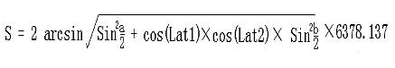

<!--truncate-->

### 根据经纬度计算距离公式



> 图片来自互联网

对上面的公式解释如下：

1. Lung1 Lat1表示A点经纬度， Lung2 Lat2表示B点经纬度；
2. a=Lat1 – Lat2 为两点纬度之差 b=Lung1 -Lung2 为两点经度之差；
3. 6378.137为地球半径，单位为千米；
4. 计算出来的结果单位为千米，若将半径改为米为单位则计算的结果单位为米。
5. 计算精度与谷歌地图的距离精度差不多，相差范围在0.2米以下。

### 参数说明

lng：经度  
lat：纬度  
地球半径：6378.137（千米）

一般地图上显示的坐标顺序为，纬度在前（范围-90 ~ 90），经度在后（范围-180 ~ 180）

### 各种语言计算距离的代码

> 这种计算方式一般都是直线距离

sql语句

``` js 
SELECT
    *,
    6378.138 * 2 * ASIN(
      SQRT(
        POW(
          SIN(
            (
              '.$lat.' * PI() / 180 - lat * PI() / 180
            ) / 2
          ), 2
        ) + COS('.$lat.' * PI() / 180) * COS(lat * PI() / 180) * POW(
          SIN(
            (
              '.$lng.' * PI() / 180 - lng * PI() / 180
            ) / 2
          ), 2
        )
      )
    ) *1000 AS distance
FROM
    distance
ORDER BY
    distance ASC
```

php计算距离

``` js 
/**
 * 根据两点间的经纬度计算距离
 * @param $lng1
 * @param $lat1
 * @param $lng2
 * @param $lat2
 * @return int
 */
public static function getDistance($lng1, $lat1, $lng2, $lat2)
{
    //将角度转为狐度
    $radLat1 = deg2rad($lat1);//deg2rad()函数将角度转换为弧度
    $radLat2 = deg2rad($lat2);
    $radLng1 = deg2rad($lng1);
    $radLng2 = deg2rad($lng2);
    $a = $radLat1 - $radLat2;
    $b = $radLng1 - $radLng2;
    $s = 2 * asin(sqrt(pow(sin($a / 2), 2) + cos($radLat1) * cos($radLat2) * pow(sin($b / 2), 2))) * 6378.137 * 1000;
    return $s;
}
```

js求距离的方法

``` js 
/**
 * 转换弧度
 * @param d
 * @returns {number}
 */
function getRad(d){
    var PI = Math.PI;
    return d*PI/180.0;
}
/**
 * 根据经纬度计算两点间距离
 * @param lng1
 * @param lat1
 * @param lng2
 * @param lat2
 * @returns {number|*}
 * @constructor
 */
function CoolWPDistance(lng1,lat1,lng2,lat2){
    var f = getRad((lat1 + lat2)/2);
    var g = getRad((lat1 - lat2)/2);
    var l = getRad((lng1 - lng2)/2);
    var sg = Math.sin(g);
    var sl = Math.sin(l);
    var sf = Math.sin(f);
    var s,c,w,r,d,h1,h2;
    var a = 6378137.0;//The Radius of eath in meter.
    var fl = 1/298.257;
    sg = sg*sg;
    sl = sl*sl;
    sf = sf*sf;
    s = sg*(1-sl) + (1-sf)*sl;
    c = (1-sg)*(1-sl) + sf*sl;
    w = Math.atan(Math.sqrt(s/c));
    r = Math.sqrt(s*c)/w;
    d = 2*w*a;
    h1 = (3*r -1)/2/c;
    h2 = (3*r +1)/2/s;
    s = d*(1 + fl*(h1*sf*(1-sg) - h2*(1-sf)*sg));
    if(s >= 1000 && s <= 99000){
        var kilometer = s/1000;
        s = kilometer.toFixed(1) + 'km';
    }else if(s > 99000){
        s = '>99km';
    }else{
        s = Math.round(s) + 'm';
    }
    // s = s/1000;
    // s = s.toFixed(2);//指定小数点后的位数。
    return s;
}
```

以上代码大部分来自网上收集，经过验证过的，可以使用
 
 
 
 
 
 
 
 
 
 
 
 
 
 
 
 
 
 
 
 
 
 
 
 
 
