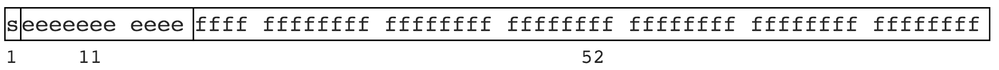

<!--truncate-->

在 js 浮点数计算存在精度问题，表现为：`0.1 + 0.2 = 0.30000000000000004`，而不是预期的 `0.3`，这里涉及到 js 中进制的问题

## 问题由来

先看一个十进制转二进制的计算过程

```js
(57).toString(2); // '111001'

// 57 /2 取余
// 28-1 => 14-0 => 7-0 => 3-1 => 1-1 => 1 所以从后往前的二进制就是 111001
```

再看一个例子

```js
(26).toString(2); // 11010

// 26 /2 取余
// 13-0 => 6-1 => 3-0 => 1-1 =>1 所以从后往前的二进制就是 11010
```

接着看下 0.1 和 0.2 计算过程

```js
(0.1)
  .toString(2)(
    // 0.0001100110011001100110011001100110011001100110011001101
    0.2
  )
  .toString(2); // 0.001100110011001100110011001100110011001100110011001101

// 0.1 * 2 取整
// 0.1 * 2 = 0.2 => 0
// 0.2 * 2 = 0.4 => 0
// 0.4 * 2 = 0.8 => 0
// 0.8 * 2 = 1.6 => 1
// 0.6 * 2 = 1.2 => 1
// 0.2 * 2 = 0.4 => 0
// 0.4 * 2 = 0.8 => 0
// 0.8 * 2 = 1.6 => 1
// 0.6 * 2 = 1.2 => 1
// 0.2 * 2 = 0.4 => 0
// 0.4 * 2 = 0.8 => 0
// ...
// 所以从前往后的二进制对应了上面的 0.00011001100... 可以看到 1100 开始无限循环
```

根据上面的例子有这么几个问题？

- js 中最大安全数是多少
- js 中能表示最大的数是多少
- js 中浮点数计算有什么陷阱

看一个四舍五入的例子，结果如下

```js
(0.104)
  .toFixed(2)(
    // 0.10
    0.105
  )
  .toFixed(2)(
    // 0.10
    0.106
  )
  .toFixed(2); // 0.11
```

为啥 `0.105` 会这样的结果，通过 `toPrecision` 来测试

```js
(0.105)
  .toPrecision(17)(
    // 0.10500000000000000
    0.105
  )
  .toPrecision(18)(
    // 0.104999999999999996
    0.105
  )
  .toPrecision(19); // 0.10499999999999999611
```

### 双精度 64 位



> 1 位用来表示符号位  
> 11 位用来表示指数，那么指数最大的数值就是 `2 ** 11 = 2048`，减去指数符号位，范围区间就是 `(-2 ** 1024, +2 ** 1024)`  
> 52 位表示尾数，**IEEE754 规定尾数第一位隐含为 1，所以 52 位有效数字实际可以存储 53 位**。

那么回答之前的问题

- js 中最大安全数是多少 `(-2 ** 53, +2 ** 53)` 即 `2 ** 53 -1` // 9007199254740991
- js 中能表示最大的数是多少 `(-2 ** 1024 + 1, +2 ** 1024 - 1)` Chrome 浏览器能显示的的最大值 `2 ** 1023 * 1.999999999999999` // 1.797693134862315e+308
- js 中浮点数计算有什么陷阱，当数值大于 `2 ** 53` 就会出现坑，比如：`2 ** 53 === 2 ** 53 + 1`

打印 `Number.prototype` 也可以看到

```js
Number {0, constructor: ƒ, toExponential: ƒ, toFixed: ƒ, toPrecision: ƒ, …}
constructor: ƒ Number()
EPSILON: 2.220446049250313e-16
MAX_SAFE_INTEGER: 9007199254740991
MAX_VALUE: 1.7976931348623157e+308
MIN_SAFE_INTEGER: -9007199254740991
MIN_VALUE: 5e-324
NEGATIVE_INFINITY: -Infinity
NaN: NaN
POSITIVE_INFINITY: Infinity
arguments: （…）
caller: （…）
isFinite: ƒ isFinite()
isInteger: ƒ isInteger()
isNaN: ƒ isNaN()
isSafeInteger: ƒ isSafeInteger()
length: 1
name: "Number"
parseFloat: ƒ parseFloat()
parseInt: ƒ parseInt()
prototype: Number {0, constructor: ƒ, toExponential: ƒ, toFixed: ƒ, toPrecision: ƒ, …}
[[Prototype]]: ƒ ()
[[Scopes]]: Scopes[0]
toExponential: ƒ toExponential()
toFixed: ƒ toFixed()
toLocaleString: ƒ toLocaleString()
toPrecision: ƒ toPrecision()
toString: ƒ toString()
valueOf: ƒ valueOf()
[[Prototype]]: Object
[[PrimitiveValue]]: 0
```

## 解决方案

这里简要提及两种方法

### 使用 BigInt 类型

> 注意只适合整数，参考：https://developer.mozilla.org/zh-CN/docs/Web/JavaScript/Reference/Global_Objects/BigInt

看一个例子，比如之前提到的最大安全数

```js
const previousMaxSafe = BigInt(Number.MAX_SAFE_INTEGER);
// ↪ 9007199254740991n

const maxPlusOne = previousMaxSafe + 1n;
// ↪ 9007199254740992n

const theFuture = previousMaxSafe + 2n;
// ↪ 9007199254740993n, this works now!

const multi = previousMaxSafe * 2n;
// ↪ 18014398509481982n

const subtr = multi – 10n;
// ↪ 18014398509481972n

const mod = multi % 10n;
// ↪ 2n

const bigN = 2n ** 54n;
// ↪ 18014398509481984n

bigN * -1n
// ↪ –18014398509481984n
```

那么，解决 `0.1 + 0.2 === 0.3` 的思路可以是 `BigInt(0.1*10)+BigInt(0.2*10) === BigInt(0.3*10)`

### 使用成熟库（推荐）

这里推荐两个库来解决浮点数精度计算的问题

> number-precision : https://github.com/nefe/number-precision  
> bignumber.js : https://github.com/MikeMcl/bignumber.js
