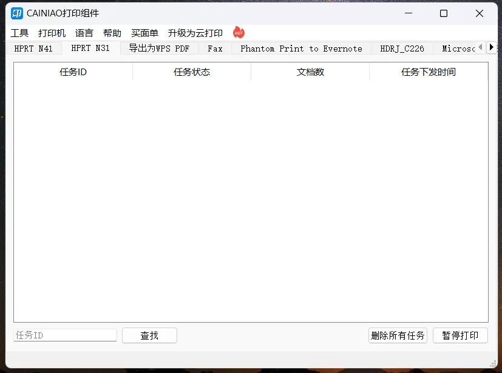

# 前端接入菜鸟打印组件

本文介绍了如何在前端项目中接入菜鸟打印组件，使得用户可以通过网页直接打印物流面单。接入过程包括准备工作和接入步骤。

<!-- truncate -->

## 准备工作

在开始接入菜鸟打印组件之前，需要进行一些准备工作：

- 下载[打印组件](https://page.cainiao.com/waybill/cloud_printing/home.html?spm=a262a.ap-detail.0.0.5aec3651pQobvi&wd=&eqid=e369c51b00001fff0000000664d38098)：从菜鸟官方网站下载最新版本的打印组件。
- 研究[开发文档](https://open.taobao.com/doc.htm?docId=107014&docType=1#ss9)：详细阅读菜鸟打印组件的开发文档，了解其接入方式和操作方法。

## 接入步骤

接入菜鸟打印组件的步骤如下：

1. **安装打印组件**

下载打印组件后，根据菜鸟的安装指南进行安装。安装完成后，确保打印组件正常运行。



2. **编辑关键代码**

在项目中编辑关键代码，主要包括以下两个基本操作：

- 获取打印机列表
- 发送数据到打印机

我们提供了一个基于 JavaScript 的示例代码，该代码通过 WebSocket 与打印组件通信，并处理打印任务的发送和结果返回。注意，我们对官方提供的示例代码做了一些改造，使之符合业务需求，并采用了异步方式来处理 WebSocket 连接和监听。

```js
class Driver {
  webSocket = null;
  promises = {};

  constructor() {
    this.doConnect();
  }

  async doConnect() {
    if (this.webSocket?.readyState == 1) {
      return this.webSocket;
    } else {
      const webSocket = new WebSocket('ws://localhost:13528');
      // 如果是https的话，端口是13529
      // webSocket = new WebSocket('wss://localhost:13529');

      // 打开连接
      webSocket.onopen = () => console.log('WebSocket opened');
      // 发生错误
      webSocket.onerror = () => console.log('WebSocket error');
      // 监听关闭
      webSocket.onclose = () => console.log('WebSocket closed');

      this.webSocket = webSocket;

      await new Promise((resolve, reject) => {
        if (webSocket.readyState === 1) {
          resolve();
        } else {
          reject('未连接到打印组件');
        }
      });

      this.onMessage();
    }
  }

  onMessage() {
    // 监听消息
    this.webSocket.onmessage = (e) => {
      const res = JSON.parse(e.data);
      const cmdResult = 'notifyPrintResult';
      const cmdPrint = 'print';

      console.log('<===== message: ', res.cmd, res);

      if (this.promises[res.cmd] || res.cmd == cmdResult) {
        const _promise =
          this.promises[res.cmd == cmdResult ? cmdPrint : res.cmd];
        if (!_promise) {
          return;
        }

        const { resolve, reject } = _promise;
        // 打印结果
        if (res.cmd == cmdResult) {
          if (['printed', 'failed'].includes(res.taskStatus)) {
            res.taskStatus == 'failed' ? reject(res) : resolve(res);
            delete this.promises[cmdPrint];
          }
        } else if (res.cmd != cmdPrint) {
          // 其他信息
          res.errorCode ? reject(res) : resolve(res);
          delete this.promises[res.cmd];
        }
      }
    };
  }

  sendMessage(cmd, data) {
    console.log('=====> message: ', cmd, data);

    // 发送消息
    return new Promise((resolve, reject) => {
      this.promises[cmd] = { resolve, reject };
      this.doConnect()
        .then(() => {
          this.webSocket.send(JSON.stringify(data));
        })
        .catch((err) => {
          this.promises[cmd].reject(err);
        });
    });
  }
}
```

这段代码封装了与打印组件的通信过程，并提供了方便的方法来发送打印任务并处理打印结果。详细的业务操作可以参考菜鸟打印组件的官方开发文档。

接下来，您可以根据项目的实际需求和菜鸟打印组件的功能进行定制和扩展，以实现更加灵活和高效的物流面单打印功能。
