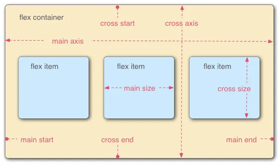

# flex 弹性布局


弹性盒子是一种用于按行或按列布局的一维布局方法，元素可以膨胀以填充额外的空间，收缩以适应更小的空间

## 主轴与交叉轴

默认横的主轴，竖的交叉轴



## flex 容器

flex 容器：`flex-direction | flex-wrap | flex-flow | justify-content | align-items | align-content`

### flex-direction（改变轴方向）

- row 默认，横为主轴
- row-reverse 横主轴反向
- column 设置列为主轴
- column-reverse 列主轴反向

:::htmlDemo

``` html
<style>
    .main {
        width: 500px;
        height: 500px;
        background-color: skyblue;
        display: flex;  
        flex-direction: column; /* 改变轴方向 */                 
    }

    .main div {
        width: 100px;
        height: 100px;
        background-color: pink;
        font-size: 20x;
    }
</style>

<div class="main">
    <div>1</div>
    <div>2</div>
    <div>3</div>
</div>
```

:::

### flex-wrap（换行）与 flex-flow（缩写）

flex-wrap

- nowrap 默认，无换行
- warp 换行
- wrap-reverse 反向换行

flex-flow：[flex-direction][flex-wrap]

:::htmlDemo

``` html
<style>
    .main {
        width: 500px;
        height: 500px;
        background-color: skyblue;
        display: flex;
        /* flex-direction: column; 改变轴方向   */
        /* flex-wrap: wrap;换行与缩进 */
        /* 缩写 */
        flex-flow: column wrap; 
    }

    .main div {
        width: 100px;
        height: 100px;
        background-color: pink;
        font-size: 20x;
    }
</style>

<div class="main">
    <div>1</div>
    <div>2</div>
    <div>3</div>
    <div>4</div>
    <div>5</div>
    <div>6</div>
    <div>7</div>
    <div>8</div>
</div>
```

:::

### just-content（主轴对齐）

- flex-start 默认，开头对齐
- flex-end 结尾对齐
- center  中间对齐
- space-around 闲散对齐，开头空隙和结尾空隙 = 中间空隙 / 2
- space-between 两端对齐，开头和结尾无空隙，中间空隙相等
- space-evenly 平均对齐，开头空隙，结尾空隙和中间空隙都相等
  
:::htmlDemo

``` html
<style>
    .main {
        width: 500px;
        height: 500px;
        background-color: skyblue;
        display: flex;
        justify-content: space-around; /*主轴对齐*/
    }

    .main div {
        width: 100px;
        height: 100px;
        background-color: pink;
        font-size: 20x;
    }
</style>

<div class="main">
    <div>1</div>
    <div>2</div>
    <div>3</div>
</div>
```

:::

### align-content（交叉轴对齐）

> 当不换行的情况下， `align-content` 不生效，所以必须配合 `flex-wrap: wrap;` 使用

- stretch 默认，拉伸：**当子元素不设置高度时拉伸为父容器的高度**
- flex-start 开头对齐
- flex-end 结尾对齐
- center  中间对齐
- space-around 闲散对齐，开头空隙和结尾空隙 = 中间空隙 / 2
- space-between 两端对齐，开头和结尾无空隙，中间空隙相等
- space-evenly 平均对齐，开头空隙，结尾空隙和中间空隙都相等

:::htmlDemo

``` html
<style>
    .main {
        width: 500px;
        height: 500px;
        background-color: skyblue;
        display: flex; 
        flex-wrap: wrap;
        /* 当不换行的情况下， align-content 不生效 */
        align-content: stretch;          
    }

    .main div {
        width: 100px;
        /* height: 100px; */
        background-color: pink;
        font-size: 20x;
    }
</style>

<div class="main">
    <div>1</div>
    <div>2</div>
    <div>3</div>
    <div>4</div>
    <div>5</div>
    <div>6</div>
    <div>7</div>
</div>
```

:::

### align-items（行对齐）

- stretch 默认，拉伸
- flex-start 顶部对齐
- flex-end 底部对齐
- center 中间对齐
- baseline 底线对齐

:::htmlDemo

``` html
<style>
    .main {
        width: 500px;
        background-color: skyblue;
        display: flex;            
        align-items: flex-end;      
    }

    .main div {
        width: 100px;
        height: 100px;
        background-color: pink;
        font-size: 20x;
    }
</style>

<div class="main">
    xyz
    <div>1</div>        
</div>
```

:::

下面是一些布局案例

### 内联与块级元素居中布局

内联元素居中

- 单行居中：line-height 等于父容器 height
- 多行居中：display: flex;
- 多行居中：display: table-cell;


:::htmlDemo

``` html
<style>
    .box {
        margin-bottom: 10px;
        width: 300px;
        height: 100px;
        background-color: skyblue;
    }

    .box1 {
        line-height: 100px;
    }

    .box2 {
        display: flex;
        align-items: center;
    }

    .box3 {
        display: flex;
        flex-wrap: wrap;
        align-content: center;
    }

    .box4 {
        display: table-cell;
        vertical-align: middle;
    }
</style>

<div class="box box1">
    单行文字
    <code>line-height:10px</code>
</div>
<div class="box box2">

    <pre>
多行文字 
        display: flex;
        align-items: center;
    </pre>
</div>
<div class="box box3">
    <pre>
多行文字 
        display: flex;
        flex-wrap: wrap;
        align-content: center;
    </pre>
</div>
<div class="box box4">
    <pre>
多行文字            
        display: table-cell;
        vertical-align: middle;
    </pre>
</div>
```

:::

块级元素居中

- 使用 flex 居中
- 使用 position 绝对定位居中

:::htmlDemo

``` html
<style>
    .box {
        margin-bottom: 10px;
        width: 300px;
        height: 200px;
        background-color: skyblue;
        position: relative;
    }

    .box div {
        width: 200px;
        height: 100px;
        background-color: pink;
    }

    .box1 {
        display: flex;
        /* 左右居中 */
        justify-content: center;
        /* 垂直居中 */
        align-items: center;
    }

    .box2 div {
        position: absolute;
        top: 50%;
        left: 50%;
        transform: translate(-50%, -50%);
    }

    .box3 {
        display: flex;
    }

    .box3 div {
        margin: auto;
    }

    .box4 div {
        position: absolute;
        top: 0;
        left: 0;
        right: 0;
        bottom: 0;
        margin: auto;
    }
</style>

<div class="box box1">
    <div>
        <pre>
display: flex;
justify-content: center;
align-items: center;
        </pre>
    </div>
</div>
<div class="box box2">
    <div>
        position: relative;
        <pre>
position: absolute;
top: 50%;
left: 50%;
transform: translate(-50%, -50%);
        </pre>
    </div>
</div>
<div class="box box3">

    <div>
        display: flex;
        <pre>
margin: auto;
        </pre>
    </div>
</div>
<div class="box box4">
    <div>
        position: relative;
        <pre>
position: absolute;
top: 0;
left: 0;
top: 0;
bottom: 0;
margin: auto;
        </pre>
    </div>
</div>
```

:::

### 不定项居中布局

- 使用 flex 居中
- 使用 position 绝对定位居中

:::htmlDemo

``` html
<style>
    .box {
        width: 300px;
        height: 150px;
        background-color: skyblue;
        margin-bottom: 10px;
    }

    .box div {
        width: 30px;
        height: 30px;
        background-color: pink;
        border-radius: 50%;
        text-align: center;
        line-height: 30px;
    }

    .box1 {
        display: flex;
        justify-content: center;
        align-items: flex-end;
    }

    .box1 div {
        margin: 10px;
    }

    .box2 {
        position: relative;
    }

    .box2 section {
        width: 100%;
        position: absolute;
        text-align: center;
        bottom: 0;
        font-size: 0;
    }

    .box2 div {
        display: inline-block;
        margin: 10px;
        font-size: 16px;
    }
</style>

<div class="box box1">
    <div>1</div>
    <div>2</div>
    <div>3</div>
</div>
<div class="box box2">
    <section>
        <div>1</div>
        <div>2</div>
        <div>3</div>
    </section>
</div>
```

:::

### 均分列布局

- 使用 flex 均分列
- 使用 float + position 布局（例子中没自适应）

:::htmlDemo

``` html
<style>
  .box {
      height: 150px;
      background-color: skyblue;
      margin-bottom: 10px;

  }

  .box div {
      width: 30px;
      height: 30px;
      background-color: pink;
      border-radius: 50%;
      text-align: center;
      line-height: 30px;
  }

  .box1 {
      display: flex;
      justify-content: space-between;
      align-items: flex-end;
      padding: 0 20px;
  }

  .box2 {
      width: 500px;
      padding: 0 20px;
      overflow: hidden;
      box-sizing: border-box;
      position: relative;
  }

  .box2 section {
      width: 600px;
      position: absolute;
      bottom: 0;
  }

  .box2 div {
      float: left;
      margin-right: 77px;
  }
</style>

<div class="box box1">
  <div>1</div>
  <div>2</div>
  <div>3</div>
  <div>4</div>
  <div>5</div>
</div>
<div class="box box2">
  <section>
      <div>1</div>
      <div>2</div>
      <div>3</div>
      <div>4</div>
      <div>5</div>
  </section>
</div>
```

:::


### 子项分组布局

- 使用 flex + 分组
- 使用 flex + margin-right:auto 自适应

:::htmlDemo

``` html
<style>
  .box {
      height: 200px;
      background-color: skyblue;
      margin-bottom: 10px;

  }

  .box .item {
      width: 50px;
      height: 100px;
      background-color: pink;
      text-align: center;
      line-height: 100px;
  }

  .box1 {
      display: flex;
      justify-content: space-between;
      align-items: center;
  }

  .box1 div:nth-of-type(2) {
      display: flex;
      margin-left: 10px;
  }

  .box2 {
      display: flex;
      align-items: center;
  }

  .box2 div {
      margin-right: 10px;
  }

  .box2 div:nth-of-type(3) {
      margin-right: auto;
  }

  .box2 div:nth-of-type(4) {
      margin-right: auto;
  }
</style>

<div class="box box1">
  <div class="item">1</div>
  <div>
      <div class="item">2</div>
      <div class="item">3</div>
  </div>
</div>
<div class="box box2">
  <div class="item">1</div>
  <div class="item">2</div>
  <div class="item">3</div>
  <div class="item">4</div>
  <div class="item">5</div>
  <div class="item">6</div>
</div>
```

:::


## flex 子项

flex 子项：`order | flex-grow | flex-shrink | flex-basis | flex | align-self`

### flex-grow（扩展比例）

- 0 默认值，表示不占用剩余的空白间隙扩展自己的宽度
- 大于等于 1 时，占满所剩空间
- 小于 1 时，就按比例占所剩空间，比如： 0.5 占一半
- 子元素都是设置了 flex-grow，就各子元素按比例

> 具体看例子里的计算

:::htmlDemo

```html
<style>
    .box {
        width: 500px;
        height: 300px;
        background-color: skyblue;
        display: flex;
        margin-bottom: 10px;
    }

    .box1 div {
        width: 100px;
        height: 100px;
        background-color: pink;
        /* 0 默认值，表示不占用剩余的空白间隙扩展自己的宽度 */
        /* flex-grow: 0;  */
        /* 如果比例值大于等于 1，就占满所剩空间 */
        /* flex-grow: 1; */
        /* 如果比例值为 0.5，占所剩空间一半，也就是 100+400/2=300 */
        flex-grow: 0.5;
    }

    .box2 div:nth-of-type(1) {
        width: 200px;
        height: 100px;
        background-color: pink;
        /* 占所剩空间的 2/3 */
        /* flex-grow: 2; */
        /* 如果小于 1，占所剩空间的 2/10 */
        flex-grow: 0.2;
    }

    .box2 div:nth-of-type(2) {
        width: 100px;
        height: 100px;
        background-color: gray;
        /* 占所剩空间的 1/3 */
        /* flex-grow: 1; */
        /* 如果小于 1，占所剩空间的 1/10 */
        flex-grow: 0.1;
    }
</style>

<p>父容器：width: 500px;</p>
<div class="box box1">
    <div>width: 100px;</div>
</div>
<div class="box box2">
    <div>width: 200px;</div>
    <div>width: 100px;</div>
</div>
```

:::


### flex-shrink（收缩比例）

- 1 默认值，表示 flex 容器空间不足时，元素的收缩比例
- 为 0 时，不收缩，多出空间会溢出
- 大于等于 1 时，自动收缩，跟容器大小相同
- 小于 1 时，多出空间按比例收缩，比如： 0.5 多出空间收缩一半
- 子元素都是设置了 flex-shrink，就各子元素按比例

> 具体看例子里的计算

:::htmlDemo

``` html
<style>
    .box {
        width: 500px;
        height: 300px;
        background-color: skyblue;
        display: flex;
        margin-bottom: 10px;
    }

    .box1 div {
        width: 600px;
        height: 100px;
        background-color: pink;
        /* 大于等于 1，自动收缩，跟容器大小相同 */
        /* flex-shrink: 2; */
        /* 为 0 时，不收缩，会溢出 */
        /* flex-shrink: 0;  */
        /* 小于 1 时，按比例收缩，500+(600-500)/2=550 */
        flex-shrink: 0.5;
    }

    .box2 div:nth-of-type(1) {
        width: 300px;
        height: 100px;
        background-color: pink;
        /* 默认时为 1 时，按比例收缩，300-(300+400-500)*3/7=214.28571428571428 */
        /* flex-shrink: 1 */
        /* 值为 2 时，300-(300+400-500)*(300*2)/(300*2+400*1) = 180 */
        /* flex-shrink: 2 */
        /* 值为 0.2 时，300-(300+400-500)*(0.2+0.1)*(300*0.2)/(300*0.2+400*0.1) = 264 */
        flex-shrink: .2;
    }

    .box2 div:nth-of-type(2) {
        width: 400px;
        height: 100px;
        background-color: gray;
        /* 默认时为 1 时，按比例收缩，400-(300+400-500)*4/7=285.7142857142857 */
        /* flex-shrink: 1 */
        /* 上面值为 2 时，400-(300+400-500)*(400*1)/(300*2+400*1) = 320 */
        /* flex-shrink:1 */
            /* 值为 1.2 时，400-(300+400-500)*(0.2+0.1)*(400*0.1)/(300*0.2+400*0.1) = 376 */
        flex-shrink: .1;
    }
</style>

<p>父容器：width: 500px;</p>
<div class="box box1">
    <div>width: 600px;</div>
</div>
<div class="box box2">
    <div>width: 300px;</div>
    <div>width: 400px;</div>
</div>
```

:::

### flex-basis（主轴大小）与 flex（缩写）

flex-basis

- auto 默认值，指定了 flex 元素在主轴方向上的初始大小
- 固定大小值：100px 50%
- 0 没有宽度，自适应高度

flex: [flex-grow][flex-shrink][flex-basis]

:::htmlDemo

```html
<style>
  .box {
      width: 500px;
      height: 300px;
      background-color: skyblue;
      display: flex;
      margin-bottom: 10px;
  }

  .box div {
      background-color: pink;
  }

  .box1 div {
      width: 100px;
      height: 100px;

      /* 设置主轴大小，覆盖 width 值 */
      flex-basis: 200px;
  }

  .box1 {
      /* 设置交叉轴大小，覆盖 height 值 */
      flex-direction: column;
  }

  .box2 {
      align-items: flex-start;
  }

  .box2 div {
      flex-basis: 0;
      /* 0 auto 100% 200px*/
  }

  .box3 {
      align-items: flex-start;
  }

  .box3 div {
      /* flex-grow: 1;
      flex-shrink: 1;
      flex-basis: 0%; */
      /* flex: 1; */

      /* flex-grow: 0;
      flex-shrink: 1;
      flex-basis: 0%; */
      /* flex: 0; */

      /* flex-grow: 1;
      flex-shrink: 1;
      flex-basis: auto; */
      /* flex: auto */

      /* flex-grow: 1;
      flex-shrink: 0;
      flex-basis: 50%; */
      flex: 1 0 50%;
  }
</style>

<div class="box box1">
    <div>
        <pre>
width: 100px;
height: 100px
        </pre>
    </div>
</div>
<div class="box box2">
    <div>
        flex-basis: 0
    </div>
</div>
<div class="box box3">
    <div>
        flex 缩写
    </div>
</div>
```

:::


### order 及 align-self

order

- 0 默认值，改变某一个 flex 子项的排序位置
- 数值越小，越排前面

align-self

- auto 默认值，控制单独某一个 flex 子项的垂直对齐方式
- 其他值跟 align-items 一样


:::htmlDemo

``` html
<style>
    .box {
        width: 500px;
        height: 300px;
        background-color: skyblue;
        display: flex;
        margin-bottom: 10px;
    }

    .box div {
        width: 100px;
        height: 100px;
        background-color: pink;
    }

    .box1 div:nth-of-type(1) {
        /* 排最后 */
        order: 1;
    }

    .box1 div:nth-of-type(4) {
        /* 排最前面 */
        order: -1;
    }

    .box2 {
        align-items: center;
    }

    .box2 div:nth-of-type(4) {
        width: 200px;
        height: 50px;
        /* 默认值 auto 时，跟随父容器 */
        align-self: flex-start;
    }
</style>

<div class="box box1">
    <div>1 order: 1</div>
    <div>2</div>
    <div>3</div>
    <div>4 order: -1</div>
</div>
<div class="box box2">
    <div>1</div>
    <div>2</div>
    <div>3</div>
    <div>4 align-self: flex-start</div>
</div>
```

:::

下面是一些布局案例

### 等高布局

- 使用 flex 实现
- 使用 float + margin-bottom + padding-bottom 技巧

:::htmlDemo

```html
<style>
    .box {
        width: 500px;
        background-color: skyblue;
        margin-bottom: 10px;
    }

    .box div {
        width: 100px;
        background-color: pink;
    }

    .box1 {
        display: flex;
        justify-content: space-between;
    }

    .box2 {
        overflow: hidden;
    }

    .box2 div {
        float: left;

        /* 实现等高技巧 */
        margin-bottom: -2000px;
        padding-bottom: 2000px;
    }

    .box2 div:nth-of-type(2) {
        width: 200px;
        float: right;
    }
</style>

<div class="box box1">
    <div>
        <p>flex 等高</p>
        <p>测试文字</p>
        <p>测试文字</p>
        <p>测试文字</p>
    </div>
    <div>
        <p>flex 等高</p>
    </div>
</div>
<div class="box box2">
    <div>
        <p>float:left</p>           
    </div>
    <div>
        <p>float:right</p>
        <pre>
实现等高技巧
margin-bottom: -2000px;
padding-bottom: 2000px;
        </pre>
    </div>
</div>
```

:::

### 两列与三列布局

- 使用 flex 实现
- 使用 float + overflow 技巧

:::htmlDemo

```html
<style>
    .box {
        height: 300px;
        background-color: skyblue;
        margin-bottom: 10px;
    }

    .box1 {
        display: flex;
    }

    .box1 .col1 {
        width: 100px;
        background-color: pink;
    }

    .box1 .col2 {
        flex-grow: 1;
        background-color: green;
    }

    .box1 .col3 {
        width: 200px;
        background-color: tomato;
    }

    .box2 .col1 {
        width: 100px;
        height: 100%;
        float: left;
        background-color: pink;
    }

    .box2 .col2 {
        height: 100%;
        background-color: green;
        overflow: hidden;
    }
</style>

<div class="box box1">
    <div class="col1">
        width:100px
    </div>
    <div class="col2">
        <pre>
        display: flex;        
        flex-grow: 1;
        </pre>
    </div>
    <div class="col3">
        width: 200px;
    </div>
</div>
<div class="box box2">
    <div class="col1">
        width:100px;
        float: left;
    </div>
    <div class="col2">
        <pre>
            overflow: hidden;
        </pre>
    </div>
</div>
```

:::

### Sticky Footer布局

中间内容区域不管多高，footer 区域都粘在底部

:::htmlDemo

```html
<style>
    .box {
        min-height: 100vh;
        margin-bottom: 10px;
    }

    .box1 {
        display: flex;
        flex-direction: column;
    }

    .box1 .header {
        height: 100px;
        background-color: pink;
    }

    .box1 .content {
        flex-grow: 1;
    }

    .box1 .footer {
        height: 100px;
        background-color: skyblue;
    }
</style>

<div class="box box1">
    <div class="header">
        height: 100px;
    </div>
    <div class="content">
        flex-grow: 1;
    </div>
    <div class="footer">
        height: 100px;
    </div>
</div>
```

:::


### 溢出项布局

- 使用 flex 布局
- 使用 float 需要计算宽度


:::htmlDemo

```html
<style>
    .box {
        height: 100px;
        margin-bottom: 10px;
        background-color: skyblue;
    }

    .box1 {
        display: flex;
        align-items: center;
    }

    .box1 div {
        width: 100px;
        height: 80px;
        background-color: pink;
        margin-right: 10px;
        flex-shrink: 0;
    }

    .box2 section{
        /* 这个宽度需要计算，这里随便设置的*/
        width: 2000px;
    }

    .box2 div{
        float: left;
        width: 100px;
        height: 80px;
        background-color: pink;
        margin-right: 10px;
    } 
</style>

<div class="box box1">
    <div>flex1</div>
    <div>flex2</div>
    <div>flex3</div>
    <div>flex4</div>
    <div>flex5</div>
    <div>flex6</div>
    <div>flex7</div>
</div>

<div class="box box2">
    <section>
        <div>float1</div>
        <div>float2</div>
        <div>float3</div>
        <div>float4</div>
        <div>float5</div>
        <div>float6</div>
        <div>float7</div>
    </section>
</div>
```

:::


## 综合案例

利用 flex 布局完成复杂布局

### 模拟 Swiper 轮播图

> 只实现布局，没实现效果

:::htmlDemo

```html
<link href="https://cdn.bootcdn.net/ajax/libs/reseter.css/2.0.0/reseter.min.css" rel="stylesheet">
<style>
@font-face {
    font-family: 'iconfont';
    /* project id 3183629 */
    src: url('');
    src: url('?#iefix') format('embedded-opentype'),
        url('//at.alicdn.com/t/font_3183629_mh80pc7g0vo.woff2') format('woff2'),
        url('//at.alicdn.com/t/font_3183629_mh80pc7g0vo.woff') format('woff'),
        url('//at.alicdn.com/t/font_3183629_mh80pc7g0vo.ttf') format('truetype'),
        url('#iconfont') format('svg');
}

.swiper-container {
    position: relative;
}

.swiper-wrapper {
    display: flex;
}

.swiper-slide {
    width: 100%;
    flex-shrink: 0;
}

.swiper-slide img {
    width: 100%;
}

.swiper-pagination {
    position: absolute;
    height: 28px;
    width: 100%;
    bottom: 0;
    display: flex;
    justify-content: center;
    align-items: center;
}

.swiper-pagination-bullet {
    width: 8px;
    height: 8px;
    border-radius: 50%;
    background-color: #c6bdb0;
    margin: 0 4px;
}

.swiper-pagination-bullet-active {
    background-color: white;
}

.swiper-button-prev,
.swiper-button-next {
    font-family: iconfont;
    position: absolute;
    top: 0;
    height: 100%;
    display: flex;
    align-items: center;
    font-size: 45px;
    color: white;
}

.swiper-button-prev {
    left: 0;
}

.swiper-button-next {
    right: 0;
}
</style>

<div class="swiper-container">
<div class="swiper-wrapper">
    <div class="swiper-slide"></div>
    <div class="swiper-slide"></div>
    <div class="swiper-slide"></div>
</div>
<!-- 如果需要分页器 -->
<div class="swiper-pagination">
    <span class="swiper-pagination-bullet swiper-pagination-bullet-active"></span>
    <span class="swiper-pagination-bullet"></span>
    <span class="swiper-pagination-bullet"></span>
</div>

<!-- 如果需要导航按钮 -->
<div class="swiper-button-prev">&#xe660;</div>
<div class="swiper-button-next">&#xe65f;</div>
</div>
```

:::

### 模拟知乎导航

> 只实现布局，没实现效果

:::htmlDemo

```html
<link href="https://cdn.bootcdn.net/ajax/libs/reseter.css/2.0.0/reseter.min.css" rel="stylesheet">
<style>
    @font-face {
        font-family: 'iconfont';
        /* Project id 3183629 */
        src: url('//at.alicdn.com/t/font_3183629_i6eba6wxxdo.woff2?t=1644896360176') format('woff2'),
            url('//at.alicdn.com/t/font_3183629_i6eba6wxxdo.woff?t=1644896360176') format('woff'),
            url('//at.alicdn.com/t/font_3183629_i6eba6wxxdo.ttf?t=1644896360176') format('truetype');
    }

    body {
        background-color: #f6f6f6;
    }

    .header-container {
        background-color: #fff;
    }

    .header-wrapper {
        margin: 0 auto;
        height: 52px;
        min-width: 1000px;
        max-width: 1156px;
        display: flex;
        align-items: center;
    }

    .header-logo {
        margin-right: 40px;
    }

    .header-logo a {
        font-size: 45px;
        font-family: iconfont;
        text-decoration: none;
    }

    .header-nav {
        display: flex;
        list-style-type: none;
    }

    .header-nav li {
        margin-right: 30px;
    }

    .header-search {
        flex-grow: 1;
        display: flex;
        justify-content: center;
    }

    .header-search .wrapper {
        max-width: 482px;
        height: 34px;
        display: flex;
        flex-grow: 1;
        background-color: #f6f6f6;
        border-radius: 100px;
        align-items: center;
        justify-content: space-between;
    }

    .header-search input {
        border: none;
        background: none;
        margin: 0 20px;
        flex-grow: 1;
    }

    .header-search .icon {
        font-family: iconfont;
        margin-right: 20px;
    }

    .header-btn {
        display: flex;
    }

    .header-btn .login {
        width: 60px;
        height: 32px;
        border: 1px #0066ff solid;
        border-radius: 3px;
        color: #0066ff;
        background: none;
        cursor: pointer;
        display: block;
        margin-left: 20px;
    }

    .header-btn .join {
        width: 90px;
        height: 32px;
        background-color: #0066ff;
        color: white;
        border: none;
        border-radius: 3px;
        display: block;
        margin-left: 20px;
        cursor: pointer;
    }
</style>

<div class="header-container">
    <div class="header-wrapper">
        <div class="header-logo">
            <a href="#">&#xe641;</a>
        </div>
        <ul class="header-nav">
            <li>首页</li>
            <li>会员</li>
            <li>发现</li>
            <li>等你来答</li>
        </ul>
        <div class="header-search">
            <div class="wrapper">
                <input type="text" placeholder="搜索">
                <span class="icon">&#xe600;</i>
            </div>
        </div>
        <div class="header-btn">
            <button class="login">登录</button>
            <button class="join">进入知乎</button>
        </div>
    </div>
</div>
```

:::
