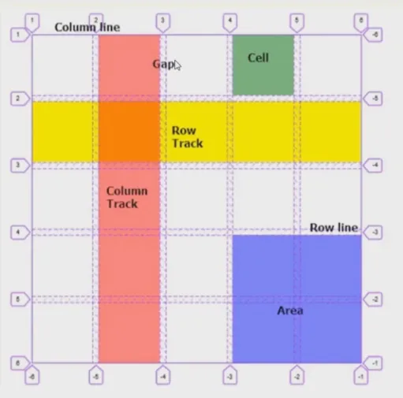

# grid 网格布局


CSS 网格是一个用于 web 的二维布局系统。利用网格，你可以把内容按照行与列的格式进行排版。另外，网格还能非常轻松地实现一些复杂的布局

## grid 容器

grid 容器有很多项

### 定义网格及 fr 单位



- `grid-template-rows` 和 `grid-template-columns` 用来基于网格行和列的维度，去定义网格线的名称和网格轨道的尺寸大小
- 单位 fr 是按剩余空间的比例计算，比如总的宽度 300px，设置 `grid-template-columns: 150px 1fr 1fr` 宽度分别：150px 75px 75px

:::htmlDemo

```html
<style>
    .main {
        width: 300px;
        height: 300px;
        background: skyblue;
        display: grid;
        /* 定义三列 和 三列*/
        /* grid-template-columns: 100px 100px 100px;           
        grid-template-rows: 100px 100px 100px; */

        /* 可以是其他单位 */
        grid-template-columns: 100px 20% auto;
        grid-template-rows: 50px 100px;

        /* 专属单位 fr 比例*/
        grid-template-columns: 150px 1fr 1fr;
        grid-template-rows: 0.3fr 0.4fr;
    }

    .main div {
        background-color: pink;
    }
</style>
<div class="main">
    <div>1</div>
    <div>2</div>
    <div>3</div>
    <div>4</div>
    <div>5</div>
    <div>6</div>
</div>
```

:::


### 合并网格及网名命名

- `grid-template-areas` 使用命名方式定义网格区域，需配合 `grid-area` 属性进行使用


:::htmlDemo

```html
<style>
    .box {
        margin-bottom: 10px;
        width: 300px;
        height: 300px;
        background: skyblue;
        display: grid;
    }

    .box div {
        background-color: pink;
        border: 1px gray solid;
        box-sizing: border-box;
    }

    .box1 {
        /* 定义网格 */
        grid-template-columns: 1fr 1fr 1fr;
        grid-template-rows: 1fr 1fr 1fr;
        /* 合并网格及网名命名 */
        grid-template-areas:
            "a1 a1 a2"
            "a1 a1 a2"
            "a3 a3 a3";
    }

    .box1 div:nth-of-type(1) {
        /* 第1个元素占4个空间 */
        grid-area: a1;
    }

    .box1 div:nth-of-type(2) {
        /* 第2个元素占2个空间 */
        grid-area: a2;
    }

    .box1 div:nth-of-type(3) {
        /* 第3个元素占3个空间 */
        grid-area: a3;
    }

    .box2 {
        /* 定义网格 */
        grid-template-columns: 1fr 1fr 1fr;
        grid-template-rows: 1fr 1fr 1fr;
        grid-template-areas:
            "a1 a2 a3";
    }

    .box2 div:nth-of-type(1) {
        /* 第1个元素放到第三个位置了*/
        grid-area: a3;
    }
</style>
<div class="box box1">
    <div>1 <small>第1个元素占4个空间</small></div>
    <div>2 <small>第2个元素占2个空间</small></div>
    <div>3 <small>第3个元素占3个空间</small></div>
</div>

<div class="box box2">
    <div>1 <small>第1个元素放到第三个位置了</small></div>
    <div>2</div>
    <div>3</div>
</div>
```

:::

- `grid-template` 是  `grid-template-rows`，`grid-template-columns` 和 `grid-template-areas` 的 缩写

:::htmlDemo

```html
<style>
    .box {
        margin-bottom: 10px;
        width: 300px;
        height: 300px;
        background: skyblue;
        display: grid;
    }

    .box div {
        background-color: pink;
        border: 1px gray solid;
        box-sizing: border-box;
    }

    .box1 {
        /* 定义网格 */
        /* grid-template-columns: 1fr 1fr 1fr;
        grid-template-rows: 1fr 1fr 1fr; */
        /* 合并网格及网名命名 */
        /* grid-template-areas:
            "a1 a1 a2"
            "a1 a1 a2"
            "a3 a3 a3"; */

        grid-template:
            "a1 a1 a2" 1fr
            "a1 a1 a2" 1fr
            "a3 a3 a3" 1fr
            / 1fr 1fr 1fr;
    }

    .box1 div:nth-of-type(1) {
        /* 第1个元素占4个空间 */
        grid-area: a1;
    }

    .box1 div:nth-of-type(2) {
        /* 第2个元素占2个空间 */
        grid-area: a2;
    }

    .box1 div:nth-of-type(3) {
        /* 第3个元素占3个空间 */
        grid-area: a3;
    }
</style>

<div class="box box1">
    <div>1 
        <pre>
缩写                
grid-template:
"a1 a1 a2" 1fr
"a1 a1 a2" 1fr
"a3 a3 a3" 1fr
/ 1fr 1fr 1fr;                
        </pre>
    </div>
    <div>2</div>
    <div>3</div>
</div>
```

:::

### 网格间隙及简写

- `grid-row-gap`， `grid-column-gap` 和 `grid-gap` 用来设置元素行列之间的间隙大小，推荐使用 `row-gap`,`column-gap`,`gap`，`grid-` 前缀已废弃
- `gap` 是 `row-gap` 和 `column-gap` 的缩写，比如 flex 布局也支持 `gap` 属性

:::htmlDemo

```html
<style>
    .box {
        margin-bottom: 10px;
        width: 300px;
        height: 300px;
        background: skyblue;
    }

    .box div {
        background-color: pink;
        border: 1px gray solid;
        box-sizing: border-box;
    }

    .box1 {
        display: grid;
        grid-template:
            "a1 a1 a2"1fr "a1 a1 a2"1fr "a3 a3 a3"1fr / 1fr 1fr 1fr;

        /* 行间隙 */
        /* grid-row-gap: 20px; */
        /* 列间隙  */
        /* grid-column-gap: 30px; */

        /* 两者的缩写 */
        gap: 20px 30px;
    }

    .box1 div:nth-of-type(1) {
        grid-area: a1;
    }

    .box1 div:nth-of-type(2) {
        grid-area: a2;
    }

    .box1 div:nth-of-type(3) {
        grid-area: a3;
    }

    .box2 {
        display: flex;
        flex-wrap: wrap;
        align-content: flex-start;
        /* 也支持间隙 */
        row-gap: 20px;
        column-gap: 30px;
    }

    .box2 div {
        width: 130px;
        height: 100px;
    }
</style>

<div class="box box1">
    <div>1 
        <pre>
display: grid; 
gap: 20px 30px;
        </pre> 
    </div>
    <div>2</div>
    <div>3</div>
</div>

<div class="box box2">
    <div>1
        <pre>
display: flex 也支持间隙
row-gap: 20px;
column-gap: 30px;
        </pre>
    </div>
    <div>2</div>
    <div>3</div>
    <div>4</div>
    <div>5</div>
</div>
```

:::


### 网格对齐方式及简写

- `justify-items` 和 `align-items` 默认值 stretch，指定了子项在网格中的对齐方式
- `place-items` 是 `justify-items` 和 `align-items` 的简写
- `justify-content` 和 `align-content` 默认值 stretch，指定了所有网格在 grid 容器中的对齐方式
- `place-content` 是 `justify-content` 和 `align-content` 的简写

import grid5 from '!!raw-loader!./snippets/grid/grid5.html';

<HtmlDemo>{grid5}</HtmlDemo>


### 显式网格与隐式网格

指定在显示网格之外的隐式网格，如何排列及尺寸大小

- `grid-auto-flow`  row 默认值，行产生隐式网格，column 列产生隐式网格，可以加一个 `dense` 的选项
- `grid-auto-rows` 可以调节产生隐式网格的高度
- `grid-auto-columns` 可以调节产生隐式网格的宽度

import grid6 from '!!raw-loader!./snippets/grid/grid6.html';

<HtmlDemo>{grid6}</HtmlDemo>

## grid 子项

分别解析

### 基于线的元素放置
 
表示 grid 子项所占据的区域的起始和终止位置，包含水平方向和垂直方向，默认值都是 auto

- `grid-column-start` 列的开始位置
- `grid-column-end` 列的终止位置
- `grid-row-start` 行的开始位置
- `grid-row-end` 行的终止位置
- grid-area 是以上四个的缩写（注意顺序是： start/start/end/end），以及额外支持 `grid-template-areas` 设置的网格名称

基于线对齐位置的缩写方式，通过 `/` 作为分割

- `grid-column` 缩写格式：`[开始]/[结束]`
- `grid-row` 缩写格式：`[开始]/[结束]`

import grid7 from '!!raw-loader!./snippets/grid/grid7.html';

<HtmlDemo>{grid7}</HtmlDemo>

### 子项对齐方式

- `justify-self` 自身行对齐
- `align-self` 自身列对齐
- `place-self` 以上两个缩写

import grid71 from '!!raw-loader!./snippets/grid/grid7-1.html';

<HtmlDemo>{grid71}</HtmlDemo>


## 方法 repeat() 与 minmax()

- repeat() 方法以及 auto-fill 可选值，指定可重复的数字
- minmax() 方法，设置最小和最大值的范围

import grid8 from '!!raw-loader!./snippets/grid/grid8.html';

<HtmlDemo>{grid8}</HtmlDemo>

## 实例

基础实例

### 比定位更方便的叠加布局

- 使用 grid 实现定位的效果

import grid9 from '!!raw-loader!./snippets/grid/grid9.html';

<HtmlDemo>{grid9}</HtmlDemo>

### 多种组合排列布局

- 使用 grid 实现排列布局

import grid10 from '!!raw-loader!./snippets/grid/grid10.html';

<HtmlDemo>{grid10}</HtmlDemo>

### 栅格布局

- 使用 grid 实现栅格布局

import grid11 from '!!raw-loader!./snippets/grid/grid11.html';

<HtmlDemo>{grid11}</HtmlDemo>

### 容器自适应行列布局

- 使用 grid 实现行列自适应

import grid12 from '!!raw-loader!./snippets/grid/grid12.html';

<HtmlDemo>{grid12}</HtmlDemo>

## 综合案例

实现比较复杂的布局

### 百度热词风云榜

只实现效果

import demo13 from '!!raw-loader!./snippets/grid/demo13.html';

<HtmlDemo>{demo13}</HtmlDemo>

### 小米商品导航菜单

只实现效果

import demo14 from '!!raw-loader!./snippets/grid/demo14.html';

<HtmlDemo>{demo14}</HtmlDemo>
