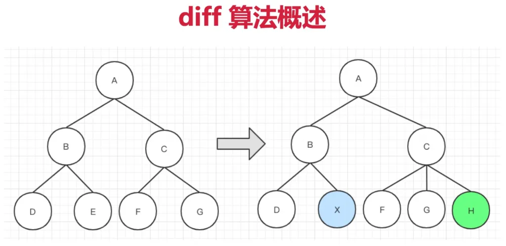
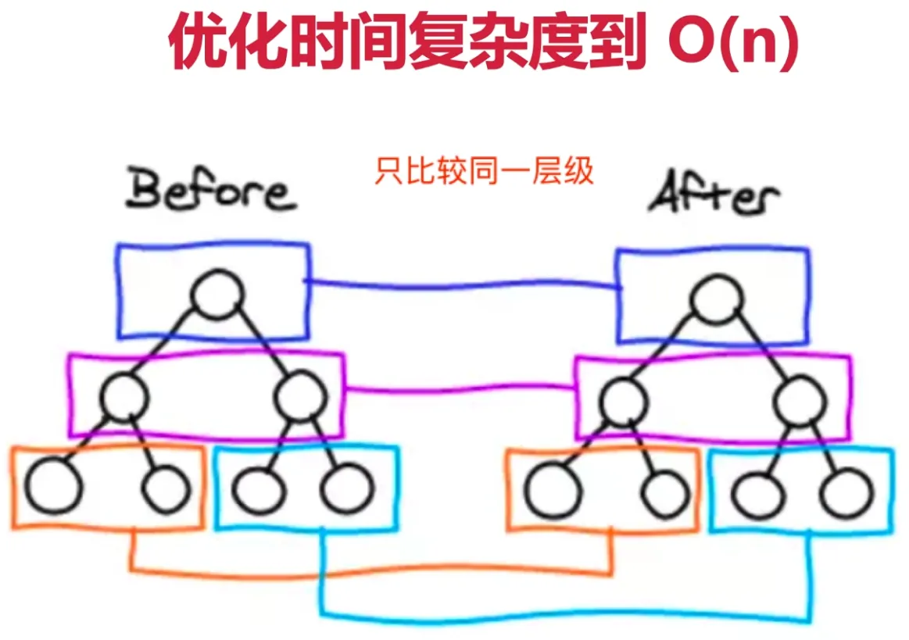
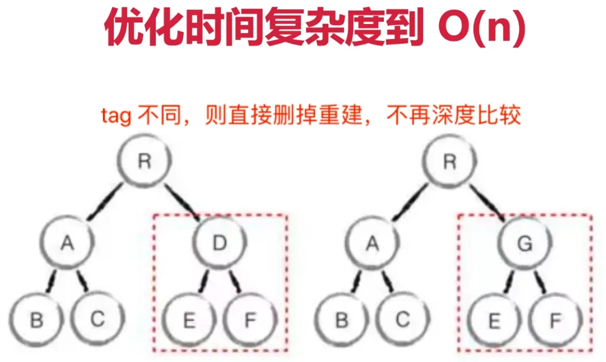

# Vue 虚拟 DOM 核心 diff 算法

diff 算法概述

- diff 即对比，是一个广泛的概念，如 linux diff 命令，git diff 等
- 两个 js 对象也可以做 diff，如：[https://github.com/cujojs/jiff](https://github.com/cujojs/jiff)
- 两颗树做 diff，如这里的 vdom diff

树 diff 的时间复杂度 O(n^3)

- 第一，遍历 tree1；第二，遍历 tree2
- 第三，排序
- 1000 个节点，需要计算 1 亿次，算法不可用

优化时间复杂度到 O(n)，采用的措施

- 只比较同一层级，不跨级比较
- tag 不相同，则直接删除重建，不再深度比较
- tag 和 key，两者都相同，则认为相同节点，不再深度比较

  

 
 
 
 
 
 
 
 
 
 
 
 
 
 
 
 
 
 
 
 
 
 
 
 
 
