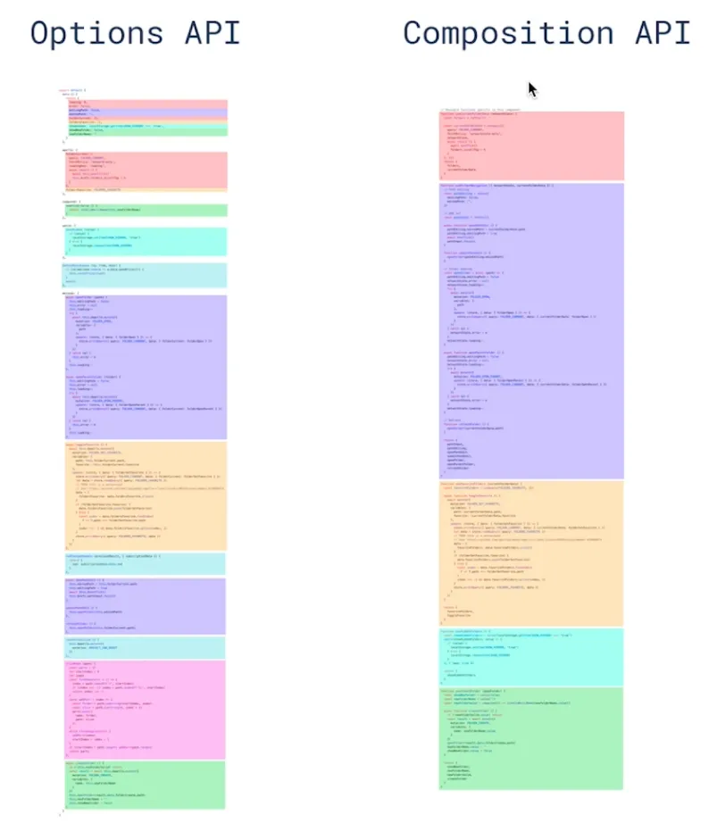

# 如何理解 Composition API 和 Options API

Composition API 带来了什么？

- 更好的代码组织
- 更好的逻辑复用（专门的面试题）
- 更好的类型推导

比如大量代码时，两者的区别

> 详情参考：https://v3.cn.vuejs.org/guide/composition-api-introduction.html
  
Composition API 和 Options API 如何选择

- 不建议共用，会引起混乱
- 小型项目，业务逻辑简单，用 Options API
- 中大型项目，逻辑复杂，用 Composition API

别误解 Composition API

- Composition API 属于高级技巧，不是基础必会
- Composition API 是为解决复杂业务逻辑而设计
- Composition API 就像 Hooks 在 React 中的地位
