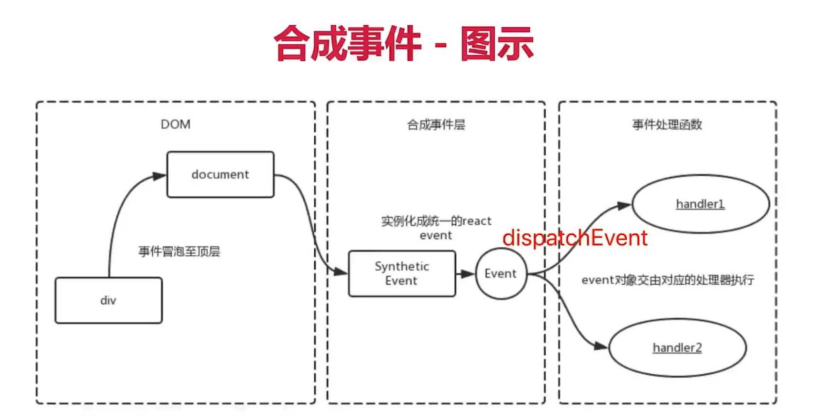

# React 的合成事件机制

合成事件

- 所有事件挂载到 document（或 root 元素）上
- event 不是原生的，是 SyntheticEvent 合成事件对象
- 和 Vue 事件不同，和 DOM 事件也不同

> event 是 SyntheticBaseEvent，模拟出来 DOM 事件所有能力

```js
// 获取 event
clickHandler3 = (e) => {
  e.preventDefault() // 阻止默认行为
  e.stopPropagation() // 阻止冒泡
  console.log('target', e.target) // 指向当前元素，即当前元素触发
  console.log('current target', e.currentTarget) // 指向当前元素，假象！

  // 注意，event 其实就是 React 封装的，可以看 __proto__.constructor 是 SyntheticBaseEvent 组合事件
  console.log('event', e) // 不是原生的 Event，原生的是 MouseEvent
  console.log('event.__proto__.constructor', e.__proto__.constructor)

  // 原生 event 如下，其 __proto__.constructor 是 MouseEvent
  console.log('nativeEvent', e.nativeEvent)
  console.log('nativeEvent', e.nativeEvent.target) // 指向当前元素，即当前元素触发
  console.log('nativeEvent', e.nativeEvent.currentTarget) // 指向 root 元素

  // 1、event 是 SyntheticBaseEvent，模拟出来 DOM 事件所有能力
  // 2、e.nativeEvent 是原生事件对象
  // 3、所有的事件，挂载到 root 元素
  // 4、和 DOM 事件不一样，和 Vue 事件也不一样
}
```

流程图



为何要合成事件机制？

- 更好的兼容性和跨平台
- 挂载到 document（或 root 元素），减少内存消耗，避免频繁解绑
- 方便事件的统一管理（如事物机制）


React 17 事件绑定到 root 组件

- React 16 绑定 document
- React 17 事件绑定到 root 组件
- 这样改进有利于多个 React 版本并存，例如微前端
