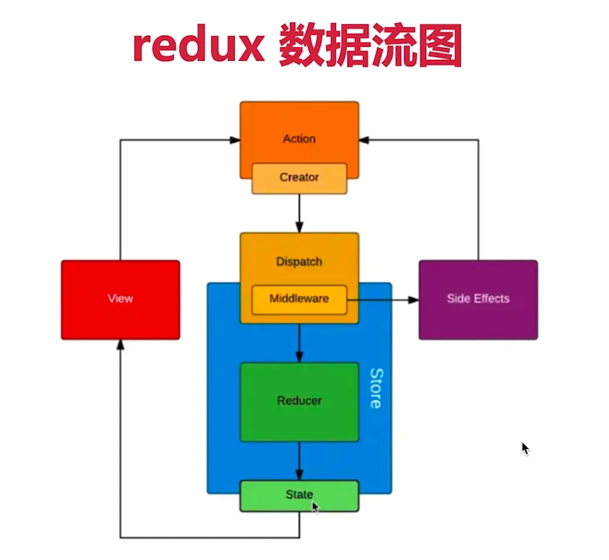
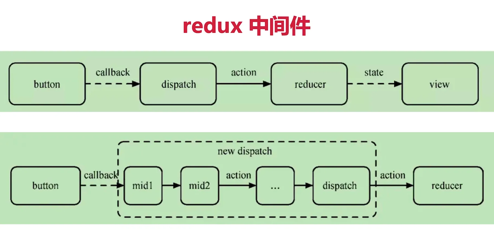

# Redux 的使用

知识点
 
- 基本概念 
- 单项数据流 
- react-redux
- 异步 action
- 中间件

## 基本概念

- store state
- action
- reducer

官网例子

```js
import { createStore } from 'redux';

/**
 * 这是一个 reducer，形式为 (state, action) => state 的纯函数。
 * 描述了 action 如何把 state 转变成下一个 state。
 *
 * state 的形式取决于你，可以是基本类型、数组、对象、
 * 甚至是 Immutable.js 生成的数据结构。惟一的要点是
 * 当 state 变化时需要返回全新的对象，而不是修改传入的参数。
 *
 * 下面例子使用 `switch` 语句和字符串来做判断，但你可以写帮助类(helper)
 * 根据不同的约定（如方法映射）来判断，只要适用你的项目即可。
 */
function counter(state = 0, action) {
  switch (action.type) {
  case 'INCREMENT':
    return state + 1;
  case 'DECREMENT':
    return state - 1;
  default:
    return state;
  }
}

// 创建 Redux store 来存放应用的状态。
// API 是 { subscribe, dispatch, getState }。
let store = createStore(counter);

// 可以手动订阅更新，也可以事件绑定到视图层。
store.subscribe(() =>
  console.log(store.getState())
);

// 改变内部 state 惟一方法是 dispatch 一个 action。
// action 可以被序列化，用日记记录和储存下来，后期还可以以回放的方式执行
store.dispatch({ type: 'INCREMENT' });
// 1
store.dispatch({ type: 'INCREMENT' });
// 2
store.dispatch({ type: 'DECREMENT' });
// 1
```

>基本例子：https://redux.js.org/introduction/getting-started#basic-example

## 单项数据流概述

- dispatch(action)
- reducer -> newState
- subscribe 触发通知



## react-redux

- `<Provider>`
- connect
- mapStateToProps mapDispatchToProps

简单示例

```js
import React from 'react'
import {Provider} from 'react-redux'
import {createStore} from 'redux'
import todoApp from './reducers'
import App from './components/App'

let store = createStore(todoApp)

export default function () {
  return <Provider store={store}>
    <App/>
  </Provider>
}
```

>完整代码：https://github.com/reduxjs/redux/tree/master/examples/todos/src

## 异步 action

同步 action

```js
// 同步 action
export const addTodo = text => {
  // 返回 action 对象
  return {
    type: 'ADD_TODO',
    id: nextTodoId++,
    text
  }
}
```

异步 action，必须配合 redux-thunk 等中间件，常用的有

- redux-thunk
- redux-promise
- redux-saga

```js
import {createStore,applyMiddleware} from 'redux'
import thunk from "redux-thunk";
import rootReducer from './reducers'

// 异步 action，需要引入中间件 redux-thunk
let store = createStore(rootReducer,applyMiddleware(thunk))

//-----------------

// 异步 action
export const addTodoAsync = text => {
  // 返回函数，其中有 dispatch 参数
  return (dispatch)=>{
    // ajax 异步获取数据
    fetch(url).then(res=>{
      // 执行异步 action
      dispatch(addTodo(res.text))
    })
  }
}
```

## 中间件原理

在 dispatch 中加中间件



例子

```js
import {createStore,applyMiddleware} from 'redux'
import thunk from "redux-thunk";
import rootReducer from './reducers'

const logger = createLogger()

// 异步 action，需要引入中间件 redux-thunk
let store = createStore(rootReducer,applyMiddleware(thunk,logger))

//-----------------------------

// 自己修改 dispatch，增加 logger
let next = store.dispatch
store.dispatch = function dispatchAndLog(action){
  console.log('dispatching',action)
  next(action)
  console.log('next state',store.getState())
}
```

