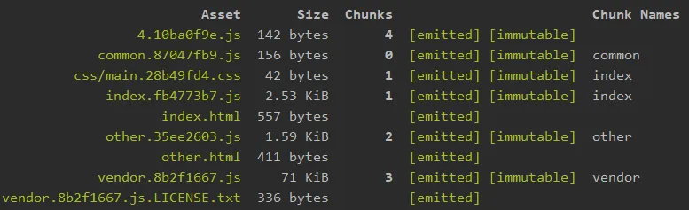
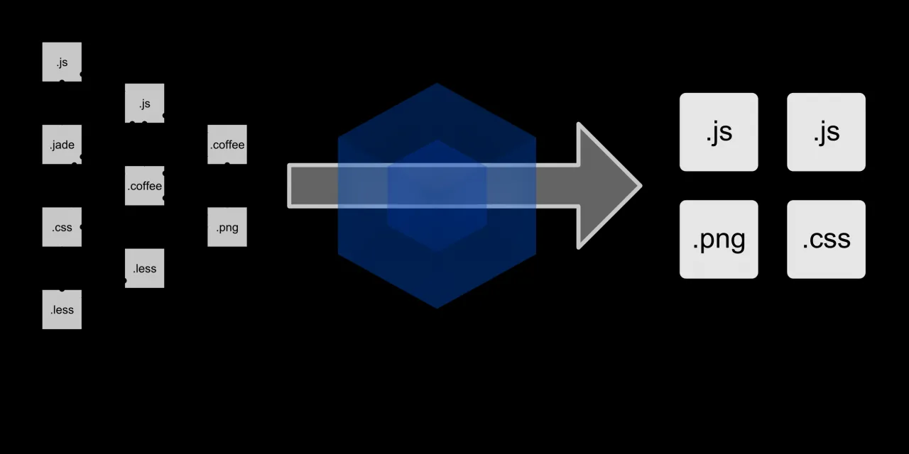

# webpack 中 module chunk bundle 的区别

module - 各个源码文件，webpack 中一切皆模块

如 src 目录下都是模块

``` js 
src
    --index.html
    --index.js
    --img
        --index.png
    --css
        --style.css
```

chunk - 多模块合并成的，如 entry import() splitChunk

entry 定义 chunk 名称

``` js 
entry: {
    index: path.join(srcPath, 'index.js'),
    other: path.join(srcPath, 'other.js')
},
```

import() 自动生成 chunk 名称

``` js 
import('./dynamic-data.js').then(res=>{
    console.log(res.default.message) // 注意这里的 default
})
```

splitChunk 定义 chunk 名称

``` js 
{
optimization: {
        // 分割代码块
        splitChunks: {
            // 缓存分组
            cacheGroups: {
                // 第三方模块
                vendor: {
                    name: 'vendor', // chunk 名称
                },
            }
        }
    }
}    
```

使用 chunk 名称

``` js 
{
    plugins: [
        // 多入口 - 生成 index.html
        new HtmlWebpackPlugin({
            // chunks 表示该页面要引用哪些 chunk （即上面的 index 和 other），默认全部引用
            chunks: ['index']  // 只引用 index.js
        }),
    ]
}
```



bundle - 最终的输出文件，也就是 asset 文件


 
 
 
 
 
 
 
 
 
 
 
 
 
 
 
 
 
 
 
 
 
 
 
 
 
