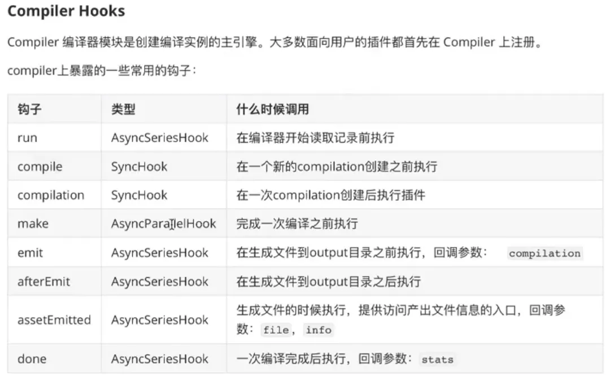

# webpack 性能优化

### 开启 `sourcemap`

配置 `devtool` 为 `sourcemap` 快熟定位错误代码源文件

```js
module.exports = {
   // 生产环境是否开启，根据具体需要，一把如果有监控系统，建议开启
  devtool: 'source-map',
}
```

这样入口 `index.js` 就会生产同样的映射关系文件 `index.js.map`
> 具体配置参考：https://webpack.docschina.org/configuration/devtool/#devtool

### 使用 `webpack-dev-server` 服务

提高本地开发效率：热更新，本地数据 mock

配置 `package.json` 使用 `webpack-dev-server` 

```json
{
  "scripts": {   
    "serve": "webpack-dev-server"
  },
}
```

然后在 `wepack.config.js` 配置

```js
module.exports = {
  devServer: {
    port: 8081, // 端口
    open: true, // 自动打开浏览器
  },
}
```

本地数据 mock 测试，安装 express 和 axois

```sh
npm i -D express axios
```

新建根目录文件 `server.js`, 执行 `node server.js` 开启服务端

```js
const express = require('express')
const app = express()

app.get('/api/info', (req, res) => {
  res.json({
    name: 'webpack'
  })
})

app.listen('8090')
```

在入口 `index.js` 中测试

```js
import axios from "axios";

axios.get('/api/info').then(res => {
  console.log(res)
})
```

此时会报错，还需要配置代理访问，在 `wepack.config.js` 配置

```js
module.exports = {
  devServer: {
    proxy: { // 代理访问
      '/api': {
        target: 'http://localhost:8090/'
      }
    }
  },
}
```

### `babel` 工具

用于编译 js 的，默认支持 js, json 模块，对于目标浏览器，我们需要转换：

```
flow -> js
jsx -> js
ts -> js
es6+ -> js
```

那么走起，首先安装 `babel` 工具

```sh
npm i -D babel-loader @babel/core @babel/preset-env @babel/polyfill core-js
```
> babel v7 之后，都是以 `@babel` 开头的仓库    
> `@babel/preset-env` 只做语法转换，es6+ -> es5    
> `@babel/polyfill` 包含 ecma 新特性的库，可以使旧浏览器支持原生较新的功能

在 `wepack.config.js` 配置使用

```js
module.exports = {
   module: {
    rules: [
      {
        test: /\.js$/,
        use: {
          loader: "babel-loader",
          options: {
            presets: ['@babel/preset-env'] 
          }
        }
      }
    ]
   }
}
```

**使用 `polyfill` 垫片**

比如在入口文件 `index.js` 添加

```js
import "@babel/polyfill"; // require("@babel/polyfill");
```

> 从 Babel 7.4.0 开始直接包含 `core-js/stable`（以 polyfill ECMAScript 功能）和`regenerator-runtime/runtime`（需要使用转译的生成器函数）

```js
import "core-js/stable";
import "regenerator-runtime/runtime";
```

配置 `polyfill` 按需加载

> 目前还是推荐使用 `@babel/polyfill` + `core-js 2.x`, `core-js 3.x` 新功能暂时用不上，引入太大

在 `wepack.config.js` 配置使用

```js
module.exports = {
   module: {
    rules: [
      {
        test: /\.js$/,
        use: {
          loader: "babel-loader",
          options: {
            presets: [
              [
                 '@babel/preset-env', // 只做语法转换，es6+ -> es5
                {
                  targets: { // 类似 browserslist 可以写成  "targets": "> 0.25%, not dead"
                    edge: '17',
                    firefox: '60',
                    chrome: '67',
                    safari: '11'
                  },
                  corejs: 2, // 新版本需要指定核心库版本，3.x 版本太大了
                  useBuiltIns: 'usage', // 按需加载 entry/usage/false
                }
              ]
            ] 
          }
        }
      }
    ]
   }
}
```
`useBuiltIns` 选项时 `babel 7` 的新功能，这个选项告诉 babel 如何配置 `@babel/polyfill`

- `entry` 在 webpack 入口文件 `import "@babel/polyfill"` 一次，babel 会根据你的使用情况导入 `polyfill` 垫片，没有使用的功能不会导入
- `usage` 不需要引入，全自动检测，还是需要安装 `@babel/polyfill`
- `false` 使用 `import "@babel/polyfill"` 会全部加载（不推荐）


以上配合导致配置文件越来越长，可以根目录新建 `.babelrc` （或 `babel.config.js`）文件，把上面的 `options` 配置放进来

```js
{
  "presets": [
    [
      '@babel/preset-env',
      // 只做语法转换，es6+ -> es5
      {
        "targets": {
          // 类似 browserslist 可以写成  "targets": "> 0.25%, not dead"
          "edge": '17',
          "firefox": '60',
          "chrome": '67',
          "safari": '11'
        },
        "corejs": 2,
        // 新版本需要指定核心库版本，3.x 版本太大了
        "useBuiltIns": 'usage'
        // 按需加载 entry/usage/false
      }
    ]
  ]
}
```

配置文件 `wepack.config.js` 就简化了

```js
module.exports = {
   module: {
    rules: [
      {
        test: /\.js$/,
        use: {
          loader: "babel-loader"          
        }
      }
    ]
   }
}
```

这样的效果一样的

### 集成 `react` 框架

首先安装 react 框架和依赖

```sh
npm i -D react react-dom @babel/preset-react
```

在 `.babelrc` 中配置

```json
{
  "presets": [
    "@babel/preset-react"
  ]
}
```

入口文件 `index.js` 测试代码

```js
import React, {Component} from "react";
import ReactDom from 'react-dom'

class App extends Component{
 render(){
   return <div> helle world </div>
 }
}

ReactDom.render(<App/>,document.getElementById('app'))
```
 
运行 `npm run dev`，打开 `/dist/index.html` 显示 `hello world`

> 如果像集成 vuejs 可以参考: https://vue-loader.vuejs.org/zh/guide/


### 如何编写一个 plugin

`webpack` 生命周期概念

-> 启动 webpack
-> 读取配置（A 插件告知 webpack 运行到哪个阶段触发 A)

在入口 `index.js` 中放入一段代码

```js
const webpack = require('webpack')
const options = require('../webpack.config')
const compiler = webpack(options) // compiler.hooks

Object.keys(compiler.hooks).forEach(hookName=>{
  if(compiler.hooks[hookName].tap){
    compiler.hooks[hookName].tap('anyString',()=>{
      console.log(`run -> ${hookName}`)
    })
  }
})

compiler.run()
```

执行 `node ./src/index.js` 打印出 webpack 所有的生命钩子

```sh
D:\www\codepress\webpack>node ./src/index.js
run -> beforeRun
run -> run
run -> normalModuleFactory
run -> contextModuleFactory
run -> beforeCompile
run -> compile
run -> thisCompilation
run -> compilation
run -> make
run -> normalModuleFactory
run -> contextModuleFactory
run -> beforeCompile
run -> compilation
run -> finishMake
run -> afterCompile
[BABEL] Note: The code generator has deoptimised the styling of D:\www\codepress\webpack\node_modules\lodash\lodash.js as it exceeds the max
 of 500KB.
[BABEL] Note: The code generator has deoptimised the styling of D:\www\codepress\webpack\node_modules\terser\dist\bundle.min.js as it exceed
s the max of 500KB.
run -> finishMake
run -> afterCompile
run -> shouldEmit
run -> emit
run -> assetEmitted
run -> assetEmitted
run -> assetEmitted
run -> afterEmit
run -> done
run -> afterDone
```



完整参考：https://webpack.docschina.org/api/compiler-hooks/#hooks


根目录新建 `myPlugins/txt-webpack-plugin.js` 插件文件，编写插件内容

```js
// 插件的结构
module.exports = class texWebpackPlugin {
  // apply
  apply(compiler) {
    // 钩入 hooks

    // 异步钩子使用 tapAsync
    compiler.hooks.emit.tapAsync('texWebpackPlugin', (compilation, cb) => {
      // console.log(compilation.assets)

      compilation.assets['lzw.txt'] = {
        source: function () {
          return 'hello lzw.'
        },
        size: function () {
          return 1024
        }
      }
      cb()
    })

    // 同步钩子使用 tap, 没有 cb 了
    compiler.hooks.compile.tap('texWebpackPlugin', (compilation) => {
      console.log(compilation)
    })
  }
}
```

然后就可以在  `wepack.config.js` 中使用

```js
const texWebpackPlugin = require('./myPlugins/txt-webpack-plugin')

module.exports = {
  plugins: [
    new texWebpackPlugin(),
  ]
}
```

运行 `npm run dev`，结果会生成 `/dist/lzw.txt` 文件

 
 
 
 
