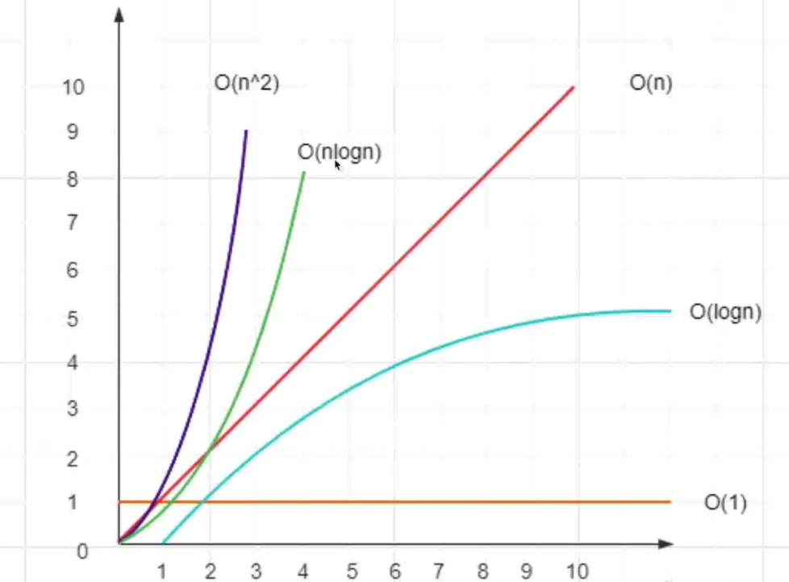

# 算法复杂度是什么？

先了解下几个概念

- 什么是复杂度
- 时间复杂度
- 空间复杂度

## 什么是复杂度

- 程序执行时需要的计算量和内存空间（和代码是否复杂无关）
- 复杂度是数量级（方便记忆，推广），不是具体的数字
- 一般针对一个具体的算法，而非一个完整的系统




## 时间复杂度

程序执行时需要的计算量（CPU）

- O(1) 一次就够（数量级）

```js
function fn(obj) {
  // O(1)
  obj.a + obj.b + obj.c; // 4~5 次
}
```

- O(N) 和传输的数据量一样（数量级）

```js
function fn(arr = []) {
  // O(N)
  for (let i = 0; i < arr.length; i++) {
    console.log(i);
  }
}
```

- O(N^2) 数据量的平方（数量级）

```js
function fn(arr = []) {
  // O(N^2)
  for (let i = 0; i < arr.length; i++) {
    for (let j = 0; j < arr.length; j++) {
      console.log(i, j);
    }
  }
}
```

- O(logN) 数据量的对数（数量级），比如 log100 = 10

```js
// arr 是一个有序数组，从中查找一个值，如 6
function fn(arr = [1, 2, 3, 4, 5, 6, 7, 8, 9]) {
  // O(logN)
  // 利用 二分思想 从中间开始查找
}
```

- O(N^logN) 数据量 \* 数据量的对数（数量级）

```js
// arr 是一个有序数组，从中查找一个值，如 6，然后嵌套一个 for 循环
function fn(arr = [1, 2, 3, 4, 5, 6, 7, 8, 9]) {
  // O(N^logN)
  for (let i = 0; i < arr.length; i++) {
    // 利用 二分思想 从中间开始查找
  }
}
```

## 空间复杂度

程序执行时需要的内存空间

- O(1) 有限的，可数的空间（数量级）

```js
function fn(arr = []) {
  // O(1)
  const a = arr[1];
  const b = arr[2];
  const c = arr[3];
}
```

- O(N) 和输入的数据量相同的空间（数量级）

```js
function fn(arr = []) {
  // O(N)

  const arr2 = [];

  for (let i = 0; i < arr.length; i++) {
    arr2[i] = arr[i] + 10;
  }
  // ...
  return arr2;
}
```

当一个算法达到 `O(N^2)` 基本上就不可用了，比如 vdom 中 tree 的 diff 算法

- 普通 diff 算法 - O(N^3)
- React/Vue 优化后 diff 算法 - O(N)

总结，复杂度是**数量级**，用 O(...) 表示，内部是一个函数表达式；对于前端开发：重时间，轻空间


