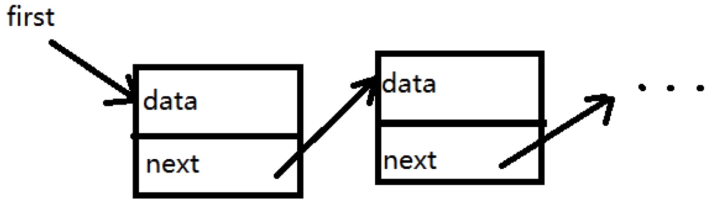

链表 - 概念

- 链表是一种物理结构（非逻辑结构），**类似**数组
- 数组需要一段连续的内存区间，而链表是零散的
- 链表节点的数据结构 {value,next?,prev?}

链表 & 数组

- 都是有序结构（Object 和 Set 无序结构，Map 有序结构）
- 链表：查询慢 O(n)，新增和删除快 O(1)
- 数组：查询快 O(1)，新增和删除慢 O(n)
- 空间复杂度都是 O(n)

