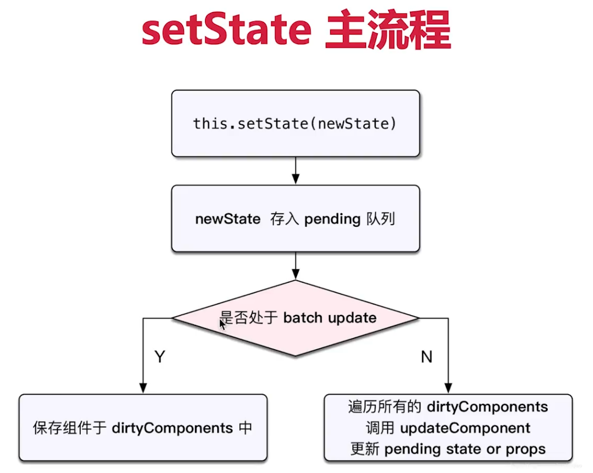
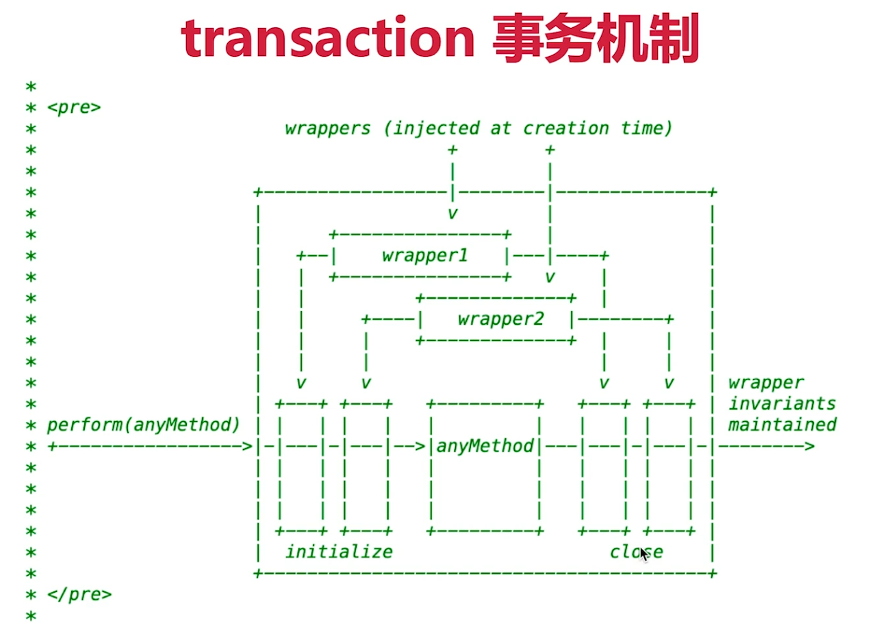

# React 的 batchUpdate 和 transaction 机制

setState 和 batchUpdate

- 有时异步（普通使用），有时同步（setTimeout、DOM 事件）
- 有时合并（对象形式），有时不合并（函数形式）
- 后者比较好理解（像 Object.assign），主要讲解前者

核心要点

- setState 主流程
- batchUpdate 机制
- transaction 事物机制

## setState 主流程



左边分支 - 异步流程（isBatchingUpdates=true）

```js
// 开始：处于 batchUpdate
// isBatchingUpdates = true
this.setState({
  count: this.state.count + 1
})
console.log('count', this.state.count) // 异步的，拿不到最新值
// 结束
// isBatchingUpdates = false
```

 右边分支 - 同步流程（isBatchingUpdates=false）

```js
// setTimeout 中 setState 是同步的
// 开始：处于 batchUpdate
// isBatchingUpdates = true
setTimeout(() => {
  // 此时 isBatchingUpdates 是 false
  this.setState({
    count: this.state.count + 1
  })
  console.log('count in setTimeout', this.state.count)
})
// 结束
// isBatchingUpdates = false
```

setState 异步还是同步？

- setState 无所谓异步还是同步
- 看是否能命中 batchUpdate 机制
- 判断 isBatchingUpdates 条件

## batchUpdate 机制

哪些能命中 batchUpdate 机制

- 生命周期（和它调用的函数）
- React 中注册的事件（和它调用的函数）
- React 可以“管理”的入口

哪些不能命中 batchUpdate 机制

- setTimeout setInterval 等（和它调用的函数）
- 自定义的 DOM 事件（和它调用的函数）
- React “管不到”的入口

## transaction 事物机制

执行过程

```js
increase = () => {
  // 开始：处于 batchUpdate
  // isBatchingUpdates = true
  
  // 其他操作

  // 结束
  // isBatchingUpdates = false
}
```

流程图



比如

```js
transaction.initialize() = function (){
  console.log('initialize')
}
transaction.close() = function (){
  console.log('close')
}
function method(){
  console.log('abc')
}

transaction.perform(method)

// initialize 
// abc
// close
```


