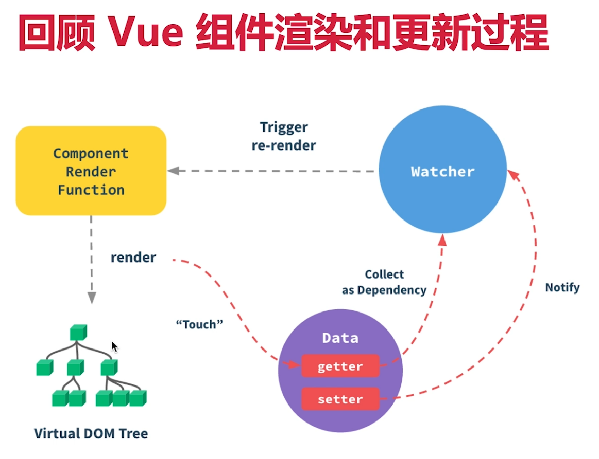

# React 组件渲染和更新的过程

问题

- JSX 如何渲染为页面
- setState 之后如何更新页面
- 全流程是怎么样

## 回顾知识点

Vue 组件渲染和更新过程

JSX 本质和 vdom

- JSX 即 createElement 函数
- 执行会生产 vnode
- patch(elem,vnode) 和 patch(vnode,newVnode)

回顾 dirtyComponents 

## 渲染和更新过程

渲染过程

- props state
- render() 生成 vnode
- patch(elem,vnode)，可能不叫 patch 名字，但过程一样

更新过程

- setState(newState) --> dirtyComponents（可能有子组件）
- render() 生成 newVnode
- patch(elem,newVnode)，可能不叫 patch 名字，但过程一样

更新的两个阶段

- 上述的 patch 被拆分为两个阶段：
- reconciliation 阶段 - 执行 diff 算法，纯 JS 计算
- commit 阶段 - 将 diff 结果渲染 DOM 

React fiber

- JS 是单线程，且和 DOM  渲染共用一个
- 当组件足够复杂，组件更新时计算和渲染都压力大
- 同时再有 DOM 操作需求（动画，鼠标拖拽等），将卡段
  
- **解决方案 fiber**
  - 将 reconciliation 阶段进行任务拆分（commit 无法拆分）
  - DOM 需要渲染时暂停，空闲时恢复
  - window.requestIdleCallback （存在兼容性）

关于 fiber

- React 内部运行机制，开发者体会不到
- 了解背景和基本概念即可

