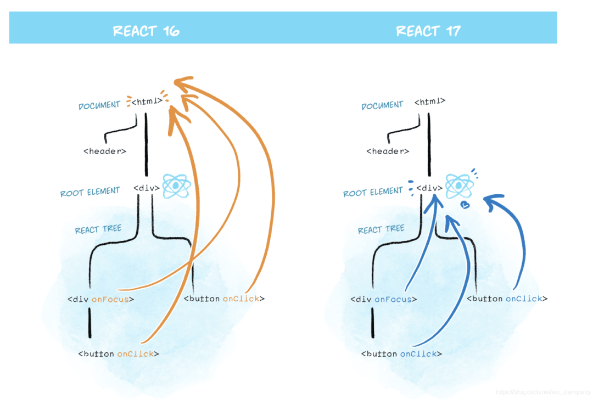

# React 事件和 bind this

事件

- bind this
- 关于 event 参数
- 传递自定义参数

例子

```js
import React from "react";

class ListDemo extends React.Component {
  constructor(props) {
    super(props);
    this.state = {
      name: 'lzw.',
      list: [
        {
          id: 'id-1',
          title: '标题-1'
        },
        {
          id: 'id-2',
          title: '标题-2'
        },
        {
          id: 'id-3',
          title: '标题-3'
        }
      ]
    }

    // 修改方法的 this 指向
    this.clickHandler1 = this.clickHandler1.bind(this)
  }

  render() {
    // this - 使用 bind
    // return <p onClick={this.clickHandler1}>
    //   {this.state.name}
    // </p>

    // this - 使用静态方法
    // return <p onClick={this.clickHandler2}>
    //   {this.state.name}
    // </p>

    // event
    // return <a href="https://lzwdot.github.io/docusaurus" onClick={this.clickHandler3}>
    //   click me
    // </a>

    // 传参 - 用 bind(this,a,b)
    return <ul>
      {
        this.state.list.map((item, index) => {
          return <li key={item.id} onClick={this.clickHandler4.bind(this, item.id, item.title)}>
            index {index}; title {item.title}
          </li>
        })
      }
    </ul>
  }

  clickHandler1() {
    console.log('this', this) // this 默认是 undefined
    this.setState({
      name: 'lzw.1'
    })
  }

  // 静态方法，this 指向当前实例
  clickHandler2 = () => {
    this.setState({
      name: 'lzw.2'
    })
  }

  // 获取 event
  clickHandler3 = (e) => {
    e.preventDefault() // 阻止默认行为
    e.stopPropagation() // 阻止冒泡
    console.log('target', e.target) // 指向当前元素，即当前元素触发
    console.log('current target', e.currentTarget) // 指向当前元素，假象！

    // 注意，event 其实就是 React 封装的，可以看 __proto__.constructor 是 SyntheticBaseEvent 组合事件
    console.log('event', e) // 不是原生的 Event，原生的是 MouseEvent
    console.log('event.__proto__.constructor', e.__proto__.constructor)

    // 原生 event 如下，其 __proto__.constructor 是 MouseEvent
    console.log('nativeEvent', e.nativeEvent)
    console.log('nativeEvent', e.nativeEvent.target) // 指向当前元素，即当前元素触发
    console.log('nativeEvent', e.nativeEvent.currentTarget) // 指向 root 元素

    // 1、event 是 SyntheticBaseEvent，模拟出来 DOM 事件所有能力
    // 2、e.nativeEvent 是原生事件对象
    // 3、所有的事件，挂载到 root 元素
    // 4、和 DOM 事件不一样，和 Vue 事件也不一样
  }

  // 接收参数
  clickHandler4 = (id, title, e) => {
    console.log(id, title)
    console.log('event', e) // 最后追加 event 参数即可使用
  }
}

export default ListDemo
```

> 注意 

- React 16 绑定 document
- React 17 事件绑定到 root 组件
- 这样改进有利于多个 React 版本并存，例如微前端

大概就是这样的 


