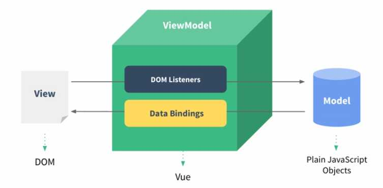

# 理解 Vue 的组件和 MVVM 模型

组件化基础

- “很久以前”就有组件化
- 组件化的创新：数据驱动视图（MVVM，setState）

“很久以前”的组件化

- asp jsp php 已经有组件化了
- nodejs 中也有类似的组件化

举个例子，不同用户：组件一样的，信息不一样

``` js 
<!--个人信息-->
<div>
    <% include('widgets/user-info',{userInfo:userInfo}) %>
</div>
<!--粉丝-->
<div>
    <% include('widgets/fans',{count:count}) %>
</div>
<!--关注-->
<div>
    <% include('widgets/followers',{count:count}) %>
</div>
```

数据驱动视图

- 传统组件，只是静态渲染，更新还要依赖于操作 DOM
- 数据驱动视图 - Vue MVVM，React setState

Vue 的 MVVM => Model，View 和 ViewModel



``` js 
<!--MVVM 代码说明-->
<template>
    <!--View-->
    <div id="app">
        <!--// click 也是 ViewModel-->
        <p @click="changeName">{{name}}</p>
        <ul>
            <li v-for="(item, index) in list" :key="index">
                {{item}}
            </li>
        </ul>
        <!--// click 也是 ViewModel-->
        <button @click="addItem">添加一项</button>
    </div>
</template>
<script>
    export default {
        name: 'app',
        data() {
            // model
            return {
                name: 'vue',
                list: ['a', 'b', 'c']
            }
        },
        methods: {
            // ViewModel
            changeName() {
                this.name = '张三'
            },
            addItem() {
                this.list.push(`${Date.now()}`)
            }
        }
    }
</script>
```
 
 
 
 
 
 
 
 
 
 
 
 
 
 
 
 
 
 
 
 
 
 
 
 
 
