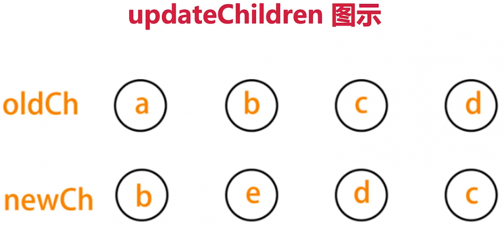
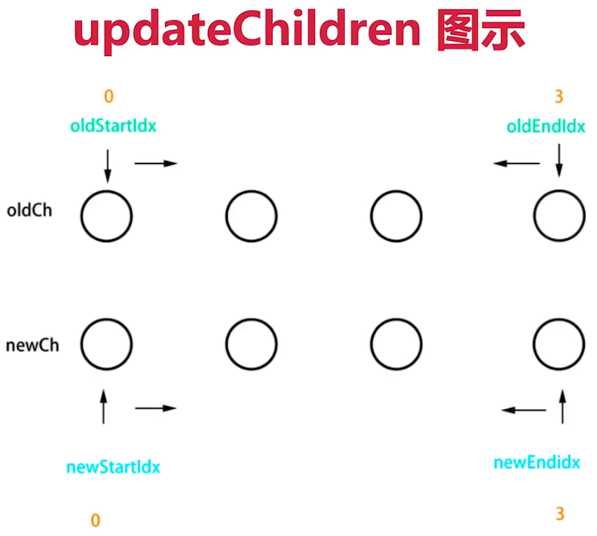
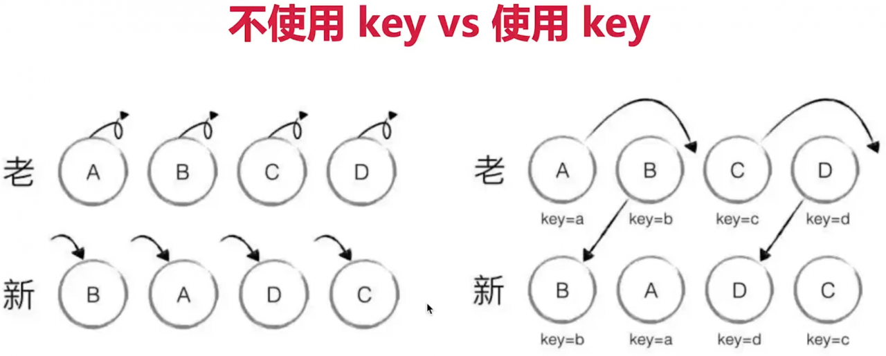

# Snabbdom 源码 diff 算法解说

[https://github.com/Snabbdom/Snabbdom](https://github.com/Snabbdom/Snabbdom) 上的一个例子代码

- vdom 核心概念：h、vnode、patch、diff、key等
- vdom 存在的价值：数据驱动视图，控制 DOM 操作

``` js 
import { init } from 'snabbdom/init'
import { classModule } from 'snabbdom/modules/class'
import { propsModule } from 'snabbdom/modules/props'
import { styleModule } from 'snabbdom/modules/style'
import { eventListenersModule } from 'snabbdom/modules/eventlisteners'
import { h } from 'snabbdom/h' // helper function for creating vnodes
var patch = init([ // Init patch function with chosen modules
  classModule, // makes it easy to toggle classes
  propsModule, // for setting properties on DOM elements
  styleModule, // handles styling on elements with support for animations
  eventListenersModule, // attaches event listeners
])
var container = document.getElementById('container')
var vnode = h('div#container.two.classes', { on: { click: someFn } }, [
  h('span', { style: { fontWeight: 'bold' } }, 'This is bold'),
  ' and this is just normal text',
  h('a', { props: { href: '/foo' } }, 'I'll take you places!')
])
// Patch into empty DOM element – this modifies the DOM as a side effect
patch(container, vnode)
var newVnode = h('div#container.two.classes', { on: { click: anotherEventHandler } }, [
  h('span', { style: { fontWeight: 'normal', fontStyle: 'italic' } }, 'This is now italic type'),
  ' and this is still just normal text',
  h('a', { props: { href: '/bar' } }, 'I'll take you places!')
])
// Second `patch` invocation
patch(vnode, newVnode) // Snabbdom efficiently updates the old view to the new state
```

根据上面的例子，一起先看下文件 h.ts 中的 h 函数

``` js 
export function h (sel: any, b?: any, c?: any): VNode {
  ...
  // 返回 vnode
  return vnode(sel, data, children, text, undefined);
};
```

接着是 snabbdom.ts 文件中的 patch 函数

``` js 
return function patch (oldVnode: VNode | Element, vnode: VNode): VNode {
    let i: number, elm: Node, parent: Node;
    const insertedVnodeQueue: VNodeQueue = [];
    // 执行 pre hook
    for (i = 0; i < cbs.pre.length; ++i) cbs.pre[i]();
    // 第一个参数不是 vnode
    if (!isVnode(oldVnode)) {
      // 创建一个空的 vnode ，关联到这个 DOM 元素
      oldVnode = emptyNodeAt(oldVnode);
    }
    // 相同的 vnode（key 和 sel 都相等）
    if (sameVnode(oldVnode, vnode)) {
      // vnode 对比
      patchVnode(oldVnode, vnode, insertedVnodeQueue);
    // 不同的 vnode ，直接删掉重建
    } else {
      elm = oldVnode.elm!;
      parent = api.parentNode(elm);
      // 重建
      createElm(vnode, insertedVnodeQueue);
      if (parent !== null) {
        api.insertBefore(parent, vnode.elm!, api.nextSibling(elm));
        removeVnodes(parent, [oldVnode], 0, 0);
      }
    }
    for (i = 0; i < insertedVnodeQueue.length; ++i) {
      insertedVnodeQueue[i].data!.hook!.insert!(insertedVnodeQueue[i]);
    }
    for (i = 0; i < cbs.post.length; ++i) cbs.post[i]();
    return vnode;
};
```

注意上面的 sameVnode 函数

``` js 
function sameVnode (vnode1: VNode, vnode2: VNode): boolean {
  // key 和 sel 都相等
  // undefined === undefined // true
  return vnode1.key === vnode2.key && vnode1.sel === vnode2.sel;
}
```

然后就是对比的 patchVnode 函数

``` js 
function patchVnode (oldVnode: VNode, vnode: VNode, insertedVnodeQueue: VNodeQueue) {
    // 执行 prepatch hook
    const hook = vnode.data?.hook;
    hook?.prepatch?.(oldVnode, vnode);
    // 设置 vnode.elem
    const elm = vnode.elm = oldVnode.elm!;
    // 旧 children
    let oldCh = oldVnode.children as VNode[];
    // 新 children
    let ch = vnode.children as VNode[];
    if (oldVnode === vnode) return;
    // hook 相关
    if (vnode.data !== undefined) {
      for (let i = 0; i < cbs.update.length; ++i) cbs.update[i](oldVnode, vnode);
      vnode.data.hook?.update?.(oldVnode, vnode);
    }
    // vnode.text === undefined （vnode.children 一般有值）
    if (isUndef(vnode.text)) {
      // 新旧都有 children
      if (isDef(oldCh) && isDef(ch)) {
        if (oldCh !== ch) updateChildren(elm, oldCh, ch, insertedVnodeQueue);
      // 新 children 有，旧 children 无 （旧 text 有）
      } else if (isDef(ch)) {
        // 清空 text
        if (isDef(oldVnode.text)) api.setTextContent(elm, '');
        // 添加 children
        addVnodes(elm, null, ch, 0, ch.length - 1, insertedVnodeQueue);
      // 旧 child 有，新 child 无
      } else if (isDef(oldCh)) {
        // 移除 children
        removeVnodes(elm, oldCh, 0, oldCh.length - 1);
      // 旧 text 有
      } else if (isDef(oldVnode.text)) {
        api.setTextContent(elm, '');
      }
    // else : vnode.text !== undefined （vnode.children 无值）
    } else if (oldVnode.text !== vnode.text) {
      // 移除旧 children
      if (isDef(oldCh)) {
        removeVnodes(elm, oldCh, 0, oldCh.length - 1);
      }
      // 设置新 text
      api.setTextContent(elm, vnode.text!);
    }
    hook?.postpatch?.(oldVnode, vnode);
}
```

最后看下比较关键的 updateChildren 函数



``` js 
function updateChildren (parentElm: Node,
    oldCh: VNode[],
    newCh: VNode[],
    insertedVnodeQueue: VNodeQueue) {
    let oldStartIdx = 0, newStartIdx = 0;
    let oldEndIdx = oldCh.length - 1;
    let oldStartVnode = oldCh[0];
    let oldEndVnode = oldCh[oldEndIdx];
    let newEndIdx = newCh.length - 1;
    let newStartVnode = newCh[0];
    let newEndVnode = newCh[newEndIdx];
    let oldKeyToIdx: KeyToIndexMap | undefined;
    let idxInOld: number;
    let elmToMove: VNode;
    let before: any;
    while (oldStartIdx <= oldEndIdx && newStartIdx <= newEndIdx) {
      if (oldStartVnode == null) {
        oldStartVnode = oldCh[++oldStartIdx]; // Vnode might have been moved left
      } else if (oldEndVnode == null) {
        oldEndVnode = oldCh[--oldEndIdx];
      } else if (newStartVnode == null) {
        newStartVnode = newCh[++newStartIdx];
      } else if (newEndVnode == null) {
        newEndVnode = newCh[--newEndIdx];
      // 开始和开始对比
      } else if (sameVnode(oldStartVnode, newStartVnode)) {
        patchVnode(oldStartVnode, newStartVnode, insertedVnodeQueue);
        oldStartVnode = oldCh[++oldStartIdx];
        newStartVnode = newCh[++newStartIdx];
      // 结束和结束对比
      } else if (sameVnode(oldEndVnode, newEndVnode)) {
        patchVnode(oldEndVnode, newEndVnode, insertedVnodeQueue);
        oldEndVnode = oldCh[--oldEndIdx];
        newEndVnode = newCh[--newEndIdx];
      // 开始和结束对比
      } else if (sameVnode(oldStartVnode, newEndVnode)) { // Vnode moved right
        patchVnode(oldStartVnode, newEndVnode, insertedVnodeQueue);
        api.insertBefore(parentElm, oldStartVnode.elm!, api.nextSibling(oldEndVnode.elm!));
        oldStartVnode = oldCh[++oldStartIdx];
        newEndVnode = newCh[--newEndIdx];
      // 结束和开始对比
      } else if (sameVnode(oldEndVnode, newStartVnode)) { // Vnode moved left
        patchVnode(oldEndVnode, newStartVnode, insertedVnodeQueue);
        api.insertBefore(parentElm, oldEndVnode.elm!, oldStartVnode.elm!);
        oldEndVnode = oldCh[--oldEndIdx];
        newStartVnode = newCh[++newStartIdx];
      // 以上四个都未命中
      } else {
        if (oldKeyToIdx === undefined) {
          oldKeyToIdx = createKeyToOldIdx(oldCh, oldStartIdx, oldEndIdx);
        }
        // 拿新节点 key ，能否对应上 oldCh 中的某个节点的 key
        idxInOld = oldKeyToIdx[newStartVnode.key as string];
        // 没对应上
        if (isUndef(idxInOld)) { // New element
          api.insertBefore(parentElm, createElm(newStartVnode, insertedVnodeQueue), oldStartVnode.elm!);
          newStartVnode = newCh[++newStartIdx];
        // 对应上了
        } else {
          // 对应上 key 的节点
          elmToMove = oldCh[idxInOld];
          // sel 是否相等（sameVnode 的条件）
          if (elmToMove.sel !== newStartVnode.sel) {
            // New element
            api.insertBefore(parentElm, createElm(newStartVnode, insertedVnodeQueue), oldStartVnode.elm!);
          // sel 相等，key 相等
          } else {
            patchVnode(elmToMove, newStartVnode, insertedVnodeQueue);
            oldCh[idxInOld] = undefined as any;
            api.insertBefore(parentElm, elmToMove.elm!, oldStartVnode.elm!);
          }
          newStartVnode = newCh[++newStartIdx];
        }
      }
    }
    if (oldStartIdx <= oldEndIdx || newStartIdx <= newEndIdx) {
      if (oldStartIdx > oldEndIdx) {
        before = newCh[newEndIdx + 1] == null ? null : newCh[newEndIdx + 1].elm;
        addVnodes(parentElm, before, newCh, newStartIdx, newEndIdx, insertedVnodeQueue);
      } else {
        removeVnodes(parentElm, oldCh, oldStartIdx, oldEndIdx);
      }
    }
}
```




 
 
 
 
 
 
 
 
 
 
 
 
 
 
 
 
 
 
 
 
 
 
 
 
 
