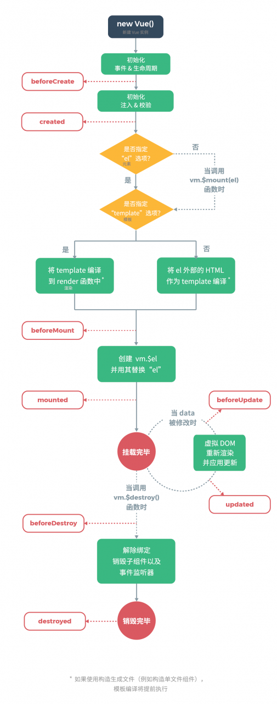

# Vue 组件生命周期

生命周期

- 挂载阶段
- 更新阶段
- 销毁阶段

单个组件的生命周期



比如一个 TodoList 功能，父组件 Index.vue，子组件 List.vue ，代码参考：

https://lzwdot.github.io/docusaurus/docs/26811

父子组件 created 和 mounted 周期

``` js 
beforeCreate
created
beforeMount
 children beforeCreate
 children created
 children beforeMount
 children mounted
mounted
 children activated
activated
```

父子组件 update 周期

``` js 
before update
 child before update
 child updated
updated
```

父子组件 destroyed 周期，通过路由切换可以触发 destroyed 事件

``` js 
beforeDestroy
 child beforeDestroy
 child destroyed
destroyed
```

父子组件 keep-alive 周期

``` js 
beforeCreate
created
beforeMount
 children beforeCreate
 children created
 children beforeMount
 children deactivated
Other deactivated
 children mounted
mounted
 children activated
activated
```
 
 
 
 
 
 
 
 
 
 
 
 
 
 
 
 
 
 
 
 
 
 
 
 
 
