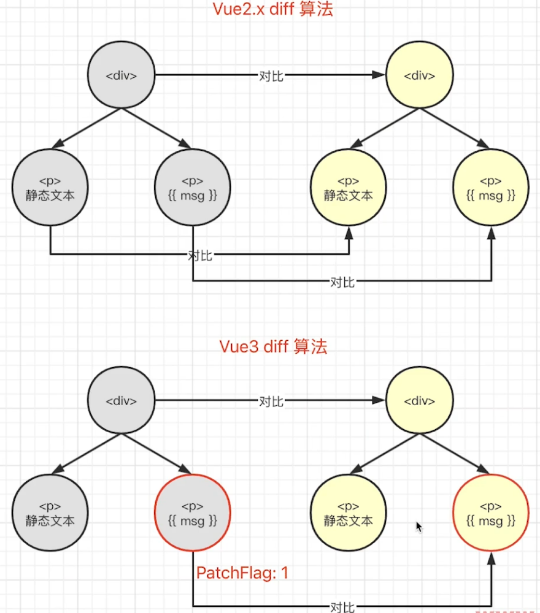

# 什么是 PatchFlag

特征

- 编译模板时，动态节点做标记
- 标记，分为不同的类型，如 TEXT, PROPS
- diff 算法时，可以区分静态节点，以及不同类型的动态节点

通过 https://vue-next-template-explorer.netlify.app 运行示例

``` html
<div>
  <span>hello vue3</span>
  <span>{{msg}}</span>
  <span :class="name">lzw</span>
  <span :id="name">lzw</span>
  <span :id="name" :msg="msg">{{msg}}</span>
</div>
```

生成的 AST 树

``` js
import { createElementVNode as _createElementVNode, toDisplayString as _toDisplayString, normalizeClass as _normalizeClass, openBlock as _openBlock, createElementBlock as _createElementBlock } from "vue"

export function render(_ctx, _cache, $props, $setup, $data, $options) {
  return (_openBlock(), _createElementBlock("div", null, [
    _createElementVNode("span", null, "hello vue3"),
    _createElementVNode("span", null, _toDisplayString(_ctx.msg), 1 /* TEXT */),
    _createElementVNode("span", {
      class: _normalizeClass(_ctx.name)
    }, "lzw", 2 /* CLASS */),
    _createElementVNode("span", { id: _ctx.name }, "lzw", 8 /* PROPS */, ["id"]),
    _createElementVNode("span", {
      id: _ctx.name,
      msg: _ctx.msg
    }, _toDisplayString(_ctx.msg), 9 /* TEXT, PROPS */, ["id", "msg"])
  ]))
}

// Check the console for the AST
```

用 PatchFlag 标记优化 diff 算法效率
> diff 算法还是一样的  
> 通过输入标记来优化  


