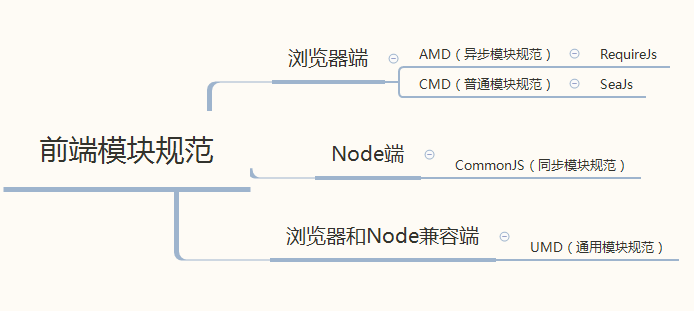

# webpack 打包公共库

一般而言，公共库都有这些

- 提供使用方式
- github 地址
- readme 文档
  - 使用方式
    - npm 平台
    - npm install
    - require
    - import
    - srcript src

  - 代码案例
- 源码输出
  - 压缩版本文件（生产环境）
  - 未压缩版本文件（开发环境）


测试代码 `./src/lib.js`

```js
export default function addNumber(a, b) {
  return a + b
}
```

先安装 webpack 打包工具

```sh
npm i -D webpack webpack-cli terser-webpack-plugin
```

> `terser-webpack-plugin` 打包公共库推荐工具

配置 `webpack.lib.config.js` 文件

```js
const path = require('path')
// 打包公共库工具
const terserWebpackPlugin = require('terser-webpack-plugin')

module.exports = {
  entry: {
    'add-number': './src/lib.js',
    'add-number.min': './src/lib.js',
  },
  output: {
    filename: '[name].js',
    library: 'addNumber', // 打包库文件
    libraryTarget: 'umd', // 打包库使用的方式，一般推荐 umd
    libraryExport: 'default' // 打包处理掉 'default'， 可以直接使用函数名 addNumber
  },
  mode: 'none',
  optimization: {
    minimize: true,
    minimizer: [
      new terserWebpackPlugin({
        test: /\.min\.js$/  // 判断什么文件需要压缩
      })
    ]
  }
}
```




根目录入口文件 `index.js` 

```js
'use strict'

if (process.env.NODE_ENV === 'production') {
  module.exports = require('./dist/add-number.min.js')
} else {
  module.exports = require('./dist/add-number.js')
}
```

添加命令和配置入口文件到 `package.json` 文件

```json
{
  "main": "index.js",
   "scripts": {
    "lib": "webpack --config ./webpack.lib.config.js",
  },
}
```

执行打包命令

```sh
npm run lib
``` 

发布到 npm 仓库，记得首先设置镜像库 

```sh
npm config set registry http://registry.npmjs.org
```

登录，输入用户名和密码

```sh
npm login
```

发布即可

```sh
npm publish
```
 
