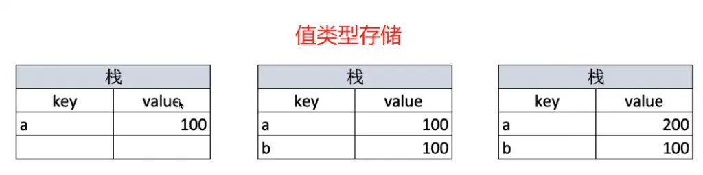
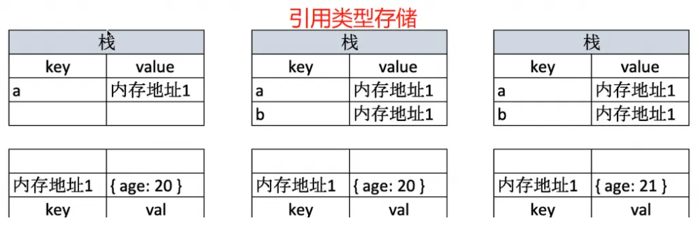

# JS 值类型和引用类型

typeof 能判断哪些类型？

- 识别所有值类型
- 识别函数
- 判断是否引用类型（不可再细分）

``` js 
//判断所有值类型
console.log(typeof a) //undefined
console.log(typeof  'abc') //string
console.log(typeof 100) // number
console.log(typeof true) // boolean
console.log( typeof Symbol('s')) //symbol
//判断函数
console.log(typeof console.log()) //function
console.log(typeof function(){}) //function
//能识别引用类型（不能再继续识别）
console.log(typeof null) // object
console.log(typeof ['a','b']) // object
console.log(typeof {x:100}) // object
```

值类型和引用类型的区别？

- 值类型，key value 存在栈
- 引用类型，key 内存地址1 保存在栈，内存地址1 value 存在堆

``` js 
//值类型
let a = 100
let b = a
a = 200
console.log(b) //100
//引用类型
let c = {x:100}
let d = c
d.x = 200
console.log(c.x) // 200
// 区别？
const obj1 = {x: 100, y: 200}
const obj2 = obj1
let x1 = obj1.x
obj2.x = 101
x1 = 102
console.log(obj1) // {x: 101, y: 200}
```





常见值类型：undefined string number boolen symbol

常见引用类型：object array

特殊引用类型：null：指针指向空地址， function：不用于存储数据，所以没有“拷贝，复制函数”一说

终极武器：`Object.prototype.toString.call()`
 
 
 
 
 
 
 
 
 
 
 
 
 
 
 
 
 
 
 
 
 
 
 
 
 
