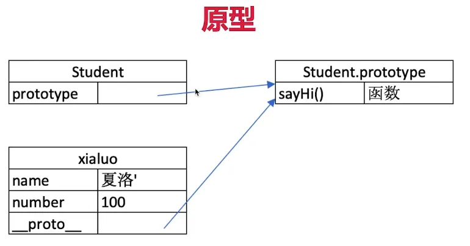

# 如何理解 JS 原型(隐式原型和显示原型)三座大山之一

通过一些例子来说明，首先定义

``` js 
class People {
    constructor(name) {
        this.name = name
    }
    eat(){
        console.log(`${this.name} eat something`)
    }
}
//子类
class Student extends People{
    constructor(name,number){
        super(name)
        this.number = number
    }
    sayHi(){
        console.log(
            `姓名${this.name}，学号${this.number}`
        )
    }
}
//实例化
const xialuo = new Student('夏洛',100)
console.log(xialuo.name,xialuo.number) //夏洛 100
xialuo.sayHi() //姓名夏洛，学号100
xialuo.eat() //夏洛 eat something
```

类型判断 - instanceof

``` js 
console.log(xialuo instanceof Student) //true
console.log(xialuo instanceof People) //true
console.log(xialuo instanceof Object) //true
```

``` js 
console.log([] instanceof Array) //true
console.log([] instanceof Object) //true
console.log({} instanceof Object) //true
```

class 的原型本质是什么？实际上是函数，可见是语法糖

``` js 
console.log(typeof People) //function
console.log(typeof Student) //function
```

原型

``` js 
console.log(xialuo.__proto__) //隐式原型
console.log(Student.prototype) // 显示原型
console.log(xialuo.__proto__ === Student.prototype) // true
```



原型关系

- 每个 class 都有显示原型 prototype
- 每个实例都有隐式原型 `__proto__`
- 实例的 `__proto__` 指向对应 class 的 prototype

基于原型的指向规则，获取属性或执行方法时

- 先在自身属性和方法寻找
- 如果找不到则自动去 `__proto__` 中查找
 
 
 
 
 
 
 
 
 
 
 
 
 
 
 
 
 
 
 
 
 
 
 
 
 
