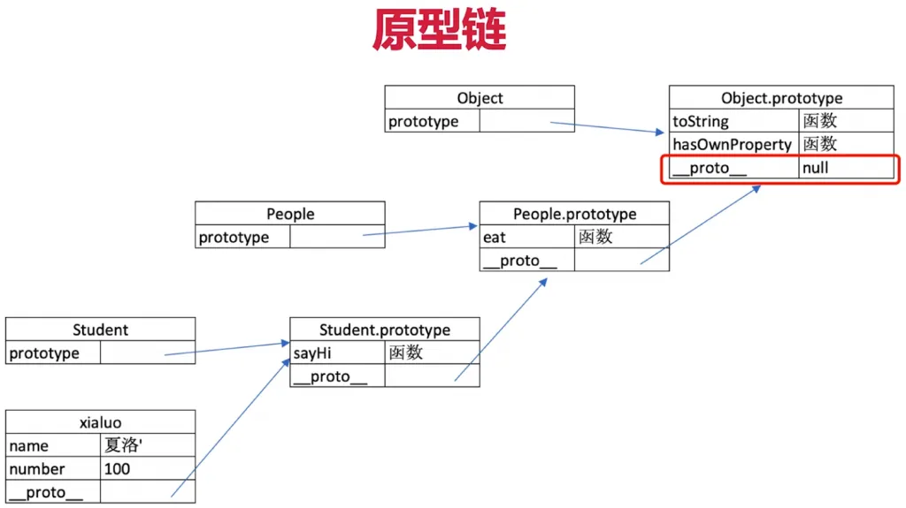

# instanceof 是基于原型链实现的

如何准确判断一个变量是数组？

``` js 
a instanceof Array
```

利用之前的一个例子

``` js 
class People {
    constructor(name) {
        this.name = name
    }
    eat(){
        console.log(`${this.name} eat something`)
    }
}
//子类
class Student extends People{
    constructor(name,number){
        super(name)
        this.number = number
    }
    sayHi(){
        console.log(
            `姓名${this.name}，学号${this.number}`
        )
    }
}
//实例化
const xialuo = new Student('夏洛',100)
console.log(xialuo.name,xialuo.number) //夏洛 100
xialuo.sayHi() //姓名夏洛，学号100
xialuo.eat() //夏洛 eat something
```

原型链

``` js 
console.log(Student.prototype.__proto__) //隐式原型
console.log(People.prototype) // 显示原型
console.log(People.prototype=== Student.prototype.__proto__) // true
```

通过原型链来理解 `instanceof` 即

``` js 
console.log(xialuo instanceof Object) //true
```


 
 
 
 
 
 
 
 
 
 
 
 
 
 
 
 
 
 
 
 
 
 
 
 
 
