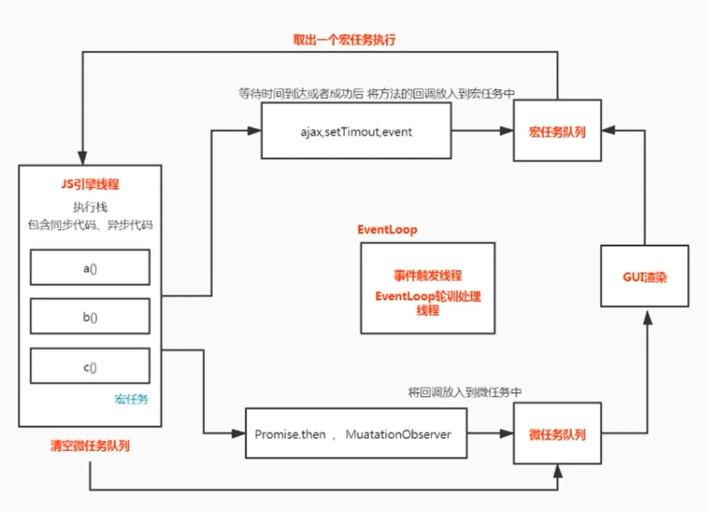
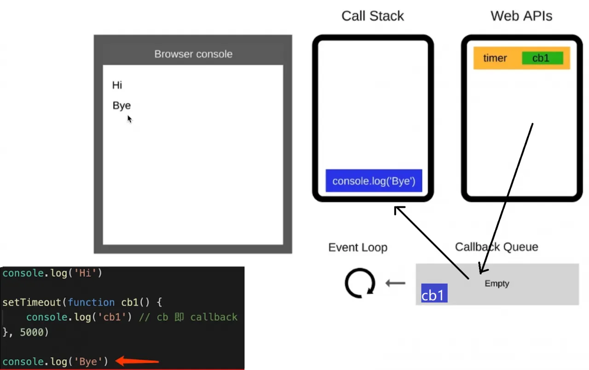

# 请描述 event loop（事件循环/事件轮询）的机制，可画图 

> 推荐阅读：https://jakearchibald.com/2015/tasks-microtasks-queues-and-schedules/



event loop（事件循环/事件轮询）

- JS 是单线程运行的
- 异步要基于回调来实现
- event loop 就是异步回调的实现原理

JS 如何执行？

- 从前到后，一行一行执行
- 如果某一行执行报错，则停止下面代码的执行
- 先执行完同步代码，再执行异步

event loop 的执行过程？

``` js 
console.log('Hi')
setTimeout(function cb1(){
    console.log('cb1') // cb1 即 callback
},5000)
console.log('Bye')
```

- 同步代码，一行一行放在 Call Stack 执行
- 遇到异步，会先“记录”下，等待时机（定时，网络请求等）
- 时机到了，就移动到 Callback Queue
- 如 Call Stack 为空（即同步代码执行完）Event Loop 开始工作
- 轮询查找 Callback Queue，如有则移动 Call Stack 执行
- 然后继续轮询查找（永动机一样）  
    

DOM 事件和 event loop 的关系

- JS 是单线程的
- 异步（setTimeout，ajax等）使用回调，基于 event loop
- DOM 事件也使用回调，基于 event loop

``` js 
<button id="btn">点击</button>
<script>
    console.log('Hi')
    document.getElementById('btn').addEventListener('click',function(e){
        console.log('clicked')
    })
    console.log('Bye')
</script>
```

> 以上代码通过点击事件把回调函数移动到 Callback Queue
 
 
 
 
 
 
 
 
 
 
 
 
 
 
 
 
 
 
 
 
 
 
 
 
 
