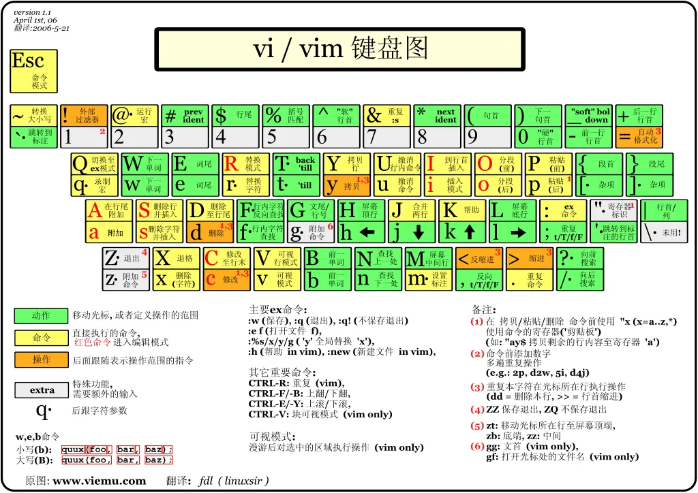

# 前端用到的 linux 常用命令有哪些

``` js 
// 登录服务
ssh root@190.168.1.1
// 查看文件， -a 查看全部，包括隐藏文件
ls [-a]
// 文件列表
ll
// 创建文件夹
mkdir [dirname]
// 删除文件或文件夹
rm -rf [dirname|filename]
// 移动文件
mv [filename] [dirname|filename]
// 拷贝文件
cp [filename] [filename]
// 新建文件
touch [filename]
vim [filename]
// 查看文件
cat [filename]
head [filename] // 前面几行
tail [filename] // 最后几行
// 查找内容
grep [string] [filename]
// vim 编辑器
```


 
 
 
 
 
 
 
 
 
 
 
 
 
 
 
 
 
 
 
 
 
 
 
 
 
