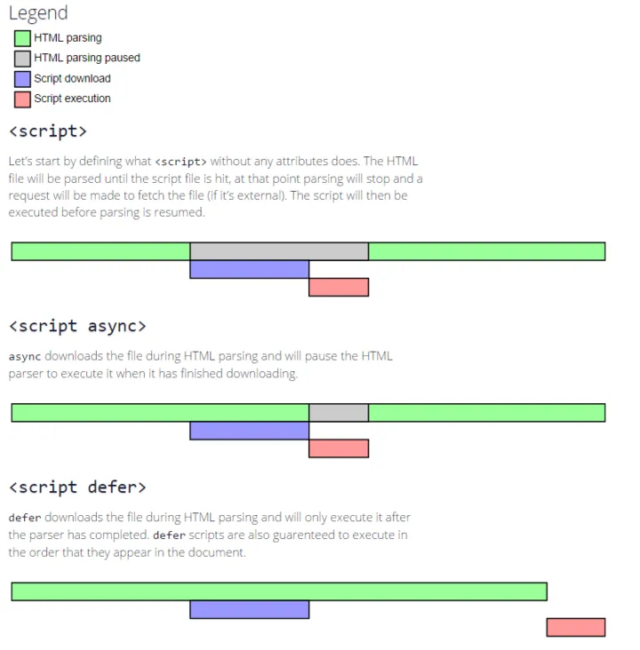

# 前端性能优化有哪些方式

性能优化原则

- 多使用内存，缓存或其他方法
- 减少 CPU 计算量，减少网络加载耗时
- （适用于所有编程的性能优化 —— 空间换时间）

> 从何下手：让加载更快，让渲染更快

让加载更快

- 减少资源体积：压缩代码
- 减少访问次数：合并代码，SSR 服务器端渲染，缓存
- 使用更快的网络：CDN

让渲染更快

- CSS 放在 head，JS 放在 body 最下面
- 尽早开始执行 JS，用 DOMContentLoaded 触发
- 懒加载（图片懒加载，上滑加载更多）
- 对 DOM 查询进行缓存
- 频繁 DOM 操作，合并到一起插入 DOM 结构
- 使用节流 throttle 防抖 debounce

> 各种缓存详解

资源合并

比如：a.js，b.js，c.js 合并为 abc.js

缓存，加 hash

- 静态资源加 hash 后缀，根据文件内容计算 hash
- 文件内容不变，则 hash 不变，则 url 不变
- url 和文件不变，则会自动触发 http 缓存机制，返回 304

SSR

- 服务器端渲染，将网页和数据一起加载，一起渲染
- 非 SSR（前后端分离）：先加载网页，再加载数据，再渲染数据
- 比如现在的 vue SSR

CDN

比如：[https://cdn.bootcdn.net/ajax/libs/twitter-bootstrap/1.4.0/css/bootstrap.css](https://cdn.bootcdn.net/ajax/libs/twitter-bootstrap/1.4.0/css/bootstrap.css)

懒加载

``` js 

<script>
    var img = document.getElementById('img')
    img.src = img.getAttribute('data-sr')
</script>
```

缓存 DOM 查询

``` js 
// 不缓存 DOM 查询结果
for (let i = 0; i < document.getElementsByTagName('p').length; i++) {}
// 缓存 DOM 查询结果
const length = document.getElementsByTagName('p').length
for (let i = 0; i < length; i++) {}
```

多个 DOM 操作一起插入 DOM 结构

``` js 
const list = document.getElementById('list')
// 创建一个文档片段，此时还没有插入到 DOM 结构中
const frag = document.createDocumentFragment()
for (let i=0; i< 10; i++){
    const li = document.createElement('li')
    li.innerHTML = `List item ${i}`
    // 先插入到文档片段中
    frag.appendChild(li)
}
// 都完成后，再统一插入到 DOM 结构中
list.appendChild(frag)
```

尽早开始执行 JS

``` js 
window.addEventListener('load',function(){
    // 页面的全部资源加载完成才会执行，包括图片，视频等
})
window.addEventListener('DOMContentLoaded',function(){
    // DOM 渲染完后即可执行，此时图片，视频可能还没加载完
})
```


 
 
 
 
 
 
 
 
 
 
 
 
 
 
 
 
 
 
 
 
 
 
 
 
 
