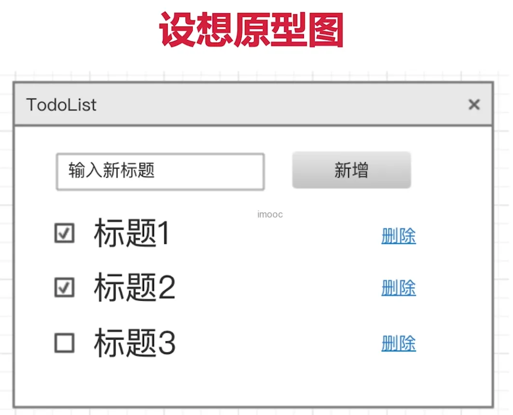

# TodoList 功能组件和状态设计

通过设计制作一个 TodoList 来说明组件和状态设计，比如要实现这样一个原型图



1、state 数据结构设计

- 用数据描述所有的内容
- 数据要结构化，易于程序操作（遍历、查找）
- 数据要可扩展，以便增加新的功能

比如

``` js 
this.state = {
    list:[ // 对象和数组数据是可描述，结构化，可扩展的
        {
            id:1, // 唯一标识
            title:'标题1',
            completed:false
        }
    ]
}
```

2、组件设计

- 从功能上拆分层次
- 尽量让组件原子化
- 容器组件（只管理数据）& UI 组件（只显示视图）


上图，第一层红线容器组件，第二层蓝线、绿线等 UI 组件

比如

``` js 
<App> <!--只负责管理数据-->
    <Input/> <!--只负责输入，将数据结果给父组件-->
    <List> <!--只负责显示列表，从父组件获取数据-->
        <ListItem /> <!--显示单条数据，删除，切换完成状态-->
        <ListItem />
        <ListItem />
    </List>
</App>
```
 
 
 
 
 
 
 
 
 
 
 
 
 
 
 
 
 
 
 
 
 
 
 
 
 
