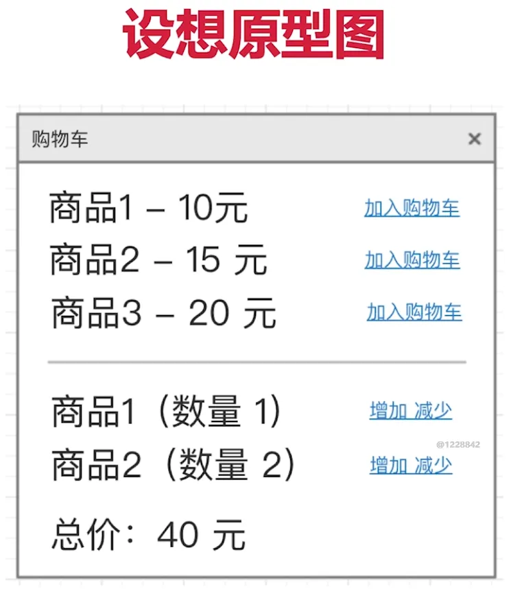
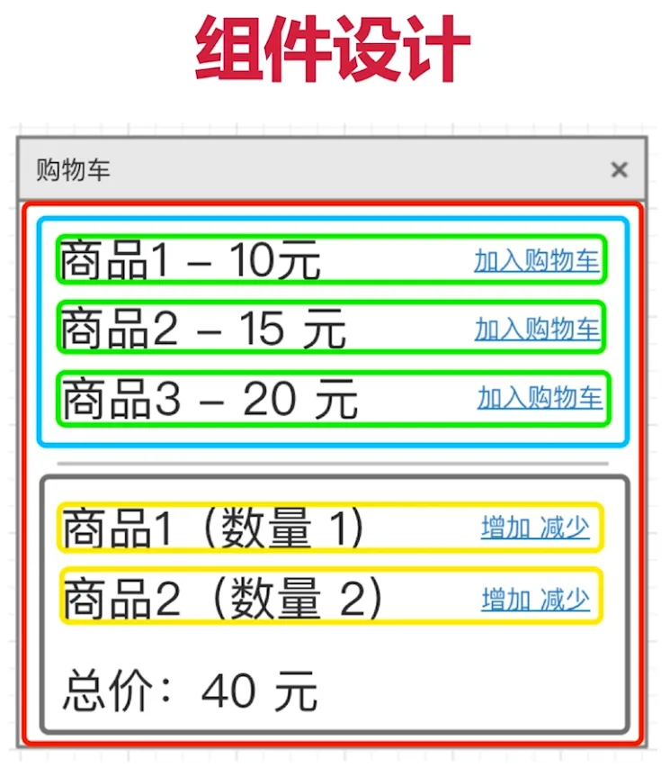

# 实现购物车功能设计

实现购物车功能，有：商品、价格、数量和总价，比如这样一个原型图



1、data 数据结构设计

- 用数据描述所有的内容
- 数据要结构化，易于程序操作（遍历、查找）
- 数据要可扩展，以便增加新的功能

比如

``` js 
this.data = {
    productionList:[ // 对象和数组数据是可描述，结构化，可扩展的
        {
            id:1,
            title:'商品',
            price:10
        }
        // ...
    ],
    cartList:[
        {
            id:1, // 使用商品 id，可扩展
            quantity:1
        }
        // ...
    ]
}
```

2、组件设计

- 从功能上拆分层次
- 尽量让组件原子化
- 容器组件（只管理数据）& UI 组件（只显示视图）



上图，第一层红线容器组件，第二层蓝线、绿线等 UI 组件

比如

``` js 
<App> <!--管理所有数据-->
    <ProductionList> <!--商品列表-->
        <ProductionListItem/>
        <ProductionListItem/>
        <ProductionListItem/>
    </ProductionList>
    <CartList><!--购物车列表和总价-->
        <CartItem/>
        <CartItem/>
    </CartList>
</App>
```
 
 
 
 
 
 
 
 
 
 
 
 
 
 
 
 
 
 
 
 
 
 
 
 
 
