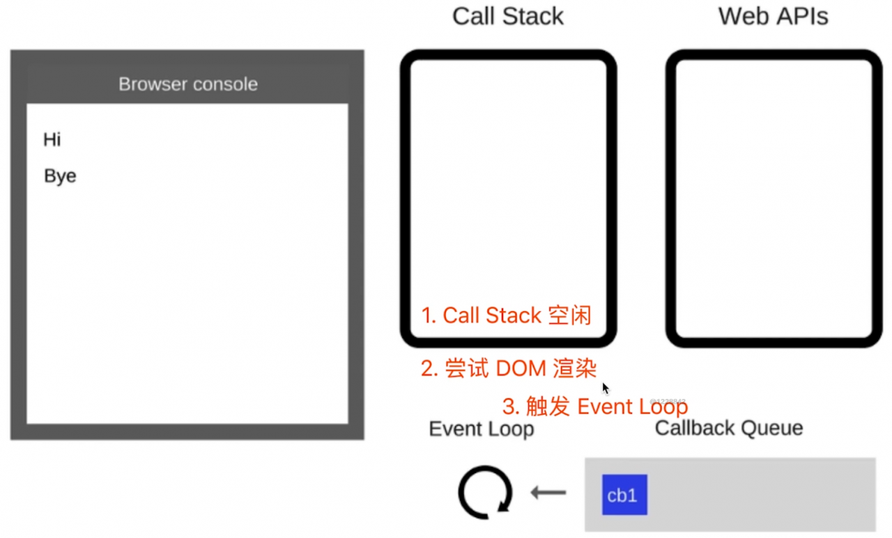
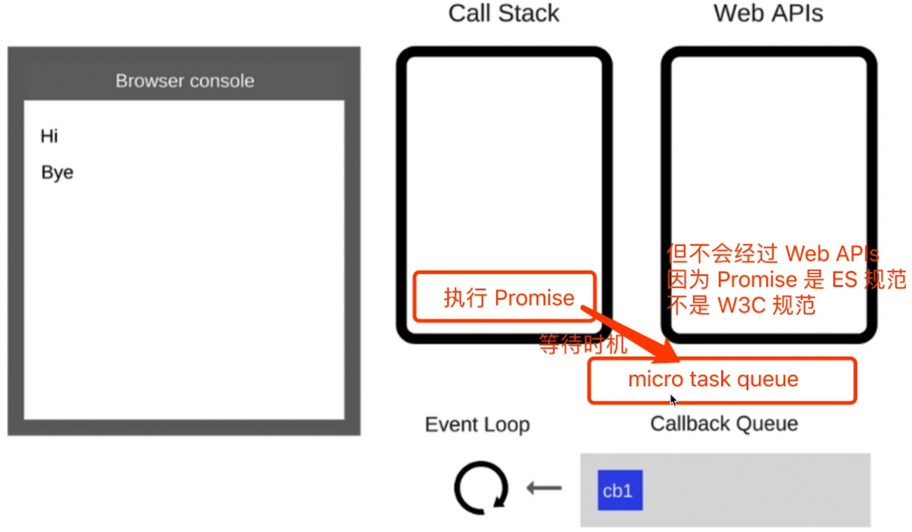
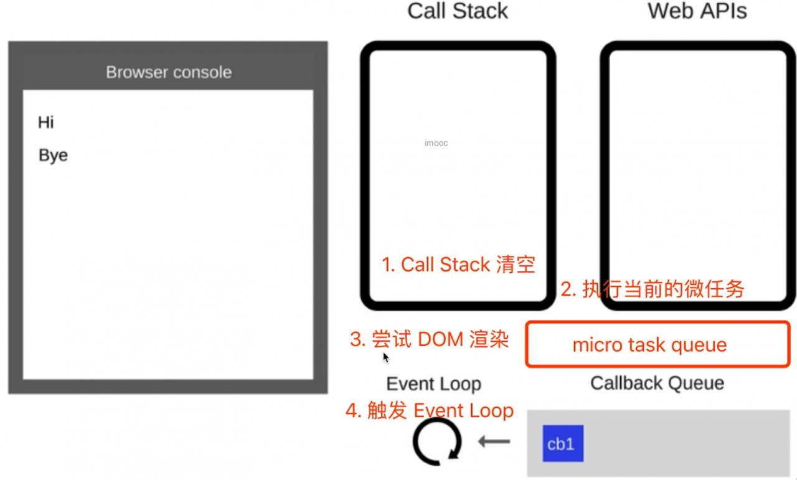

# 宏任务 macroTask 和微任务 microTask

什么是宏任务，什么是微任务

- 宏任务：setTimeout，setInterval，Ajax，DOM事件
- 微任务：Promise async/await
- 微任务执行时机比宏任务要早（记住）

``` js 
console.log(100)
// 宏任务
setTimeout(()=>{
    console.log(200)
})
// 微任务
Promise.resolve().then(()=>{
    console.log(300)
})
console.log(400)
// 100
// 400
// 300
// 200
```

event loop 和 DOM 渲染（再次回归一遍 event loop 的过程）

- JS 是单线程的，而且和 DOM 渲染共用一个线程
- JS 执行的时候，得留一些时机供 DOM 渲染

``` js 
console.log('Hi')
setTimeout(function cb1(){
    console.log('cb1') // cb1 即 callback
},5000)
console.log('Bye')
```



> 每次 Call Stack 清空（即每次轮询结束），即同步任务执行完；都是 DOM 重新渲染的机会，DOM 结构如有改变则重新渲染；然后再去触发下一次 Event Loop

``` js 
const $p1 = '<p>一段文字</p>';
const $p2 = '<p>一段文字</p>';
const $p3 = '<p>一段文字</p>';
const $container = document.getElementById('container');
$container.append($p1)
$container.append($p2)
$container.append($p3)
// length 3
console.log('length', document.getElementById('container').children.length)
// （alert 会阻断 js 执行，也会阻断 DOM 渲染，便于查看效果）
alert('本次 call stack 结束，DOM 结构已更新，但尚未触发渲染')
```

微任务和宏任务的区别

- 宏任务：DOM 渲染后触发，如 setTimeout
- 微任务：DOM 渲染前触发，如 Promise，代码演示：

``` js 
const $p1 = '<p>一段文字</p>';
const $p2 = '<p>一段文字</p>';
const $p3 = '<p>一段文字</p>';
const $container = document.getElementById('container');
$container.append($p1)
$container.append($p2)
$container.append($p3)
// 微任务：DOM 渲染前触发
Promise.resolve().then(()=>{
    // length1 3
    console.log('length1',document.getElementById('container').children.length)
    alert('Promise then') // DOM 渲染了吗？ - No
})
// 宏任务：DOM 渲染后触发
setTimeout(()=>{
    // length2 6
    console.log('length2',document.getElementById('container').children.length)
    alert('setTimeout') // DOM 渲染了吗？ - Yes
})
```

从 event loop 解释，为何微任务执行更早？

- 微任务是 ES6 语法规定的
- 宏任务是由浏览器规定的




 
 
 
 
 
 
 
 
 
 
 
 
 
 
 
 
 
 
 
 
 
 
 
 
 
