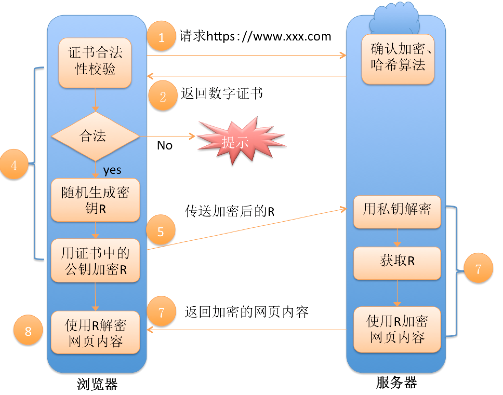

# 简述 https 的工作流程

说起 https 的工作流程，首先我们来看下 http 的简单工作流程

> 浏览器<——>web服务器
> 
> 1、发起 http 请求=>  
> 2、<=返回响应

简单工作流程就这样完成了。https 是在 http 的基础上增加了 ssl 协议，那么 https 的工作流程是怎么样的？

> 浏览器<——>web 服务器
> 
> _**第一次 http 请求**_
> 
> 1、客户端向服务器发起 https 请求，连接到服务器的 443 端口  
> 2、服务器端有一个密钥对，即公钥和私钥，是用来进行非对称加密使用的，服务器端保存着私钥。  
> 3、服务器将自己的公钥证书发送给客户端。  
> 4、客户端收到服务器端的证书之后，会对证书进行检查，验证其合法性，如果发现发现证书有问题，那么 https 传输就无法继续。严格的说，这里应该是验证服务器发送的数字证书的合法性。如果公钥合格，那么客户端会生成一个随机秘钥 R，然后用服务器的公钥加密。
> 
> _**第二次 http 请求**_
> 
> 5、客户端发起 https 中的第二个 http 请求，将加密之后的随机秘钥 R 发送给服务器。  
> 6、服务器接收到客户端发来的密文之后，会用自己的私钥对其进行非对称解密，解密之后的明文就是随机秘钥 R，然后用随机秘钥 R 对数据进行对称加密，这样数据就变成了密文。  
> 7、然后服务器将加密后的密文发送给客户端。  
> 8、客户端收到服务器发送来的密文，用随机秘钥 R 对其进行对称解密，得到服务器发送的数据。

总之，这样来来去去的就是为了**安全地**得到**密钥 R**，最终用会话密钥来加解密数据，工作流程大概是这样的。
 
 
 
 
 
 
 
 
 
 
 
 
 
 
 
 
 
 
 
 
 
 
 
 
 
