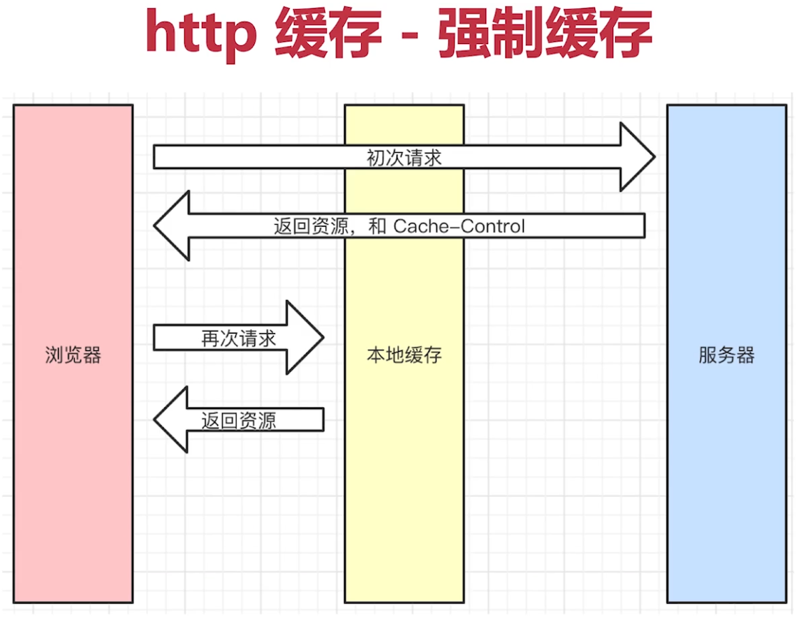
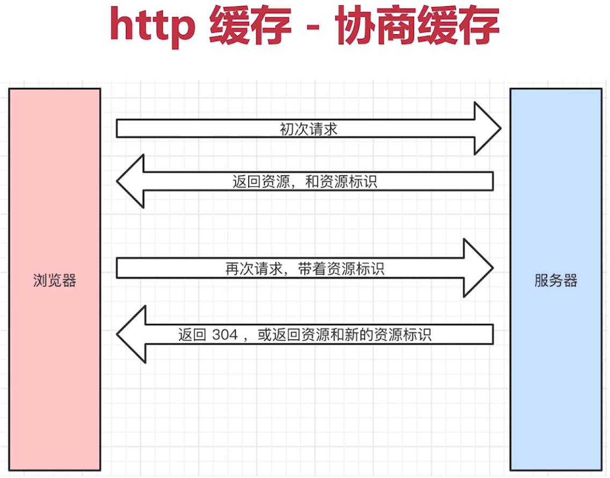
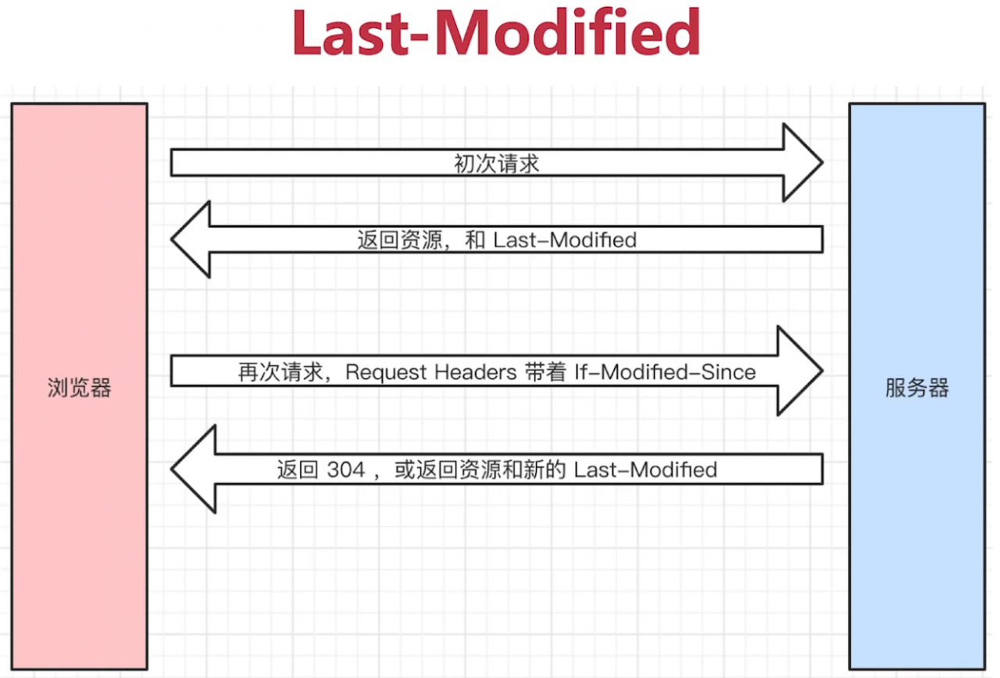
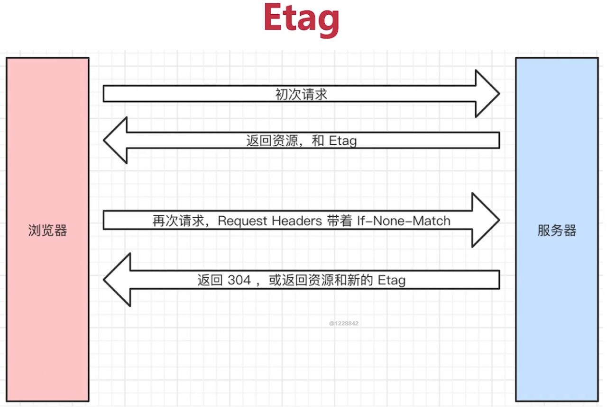
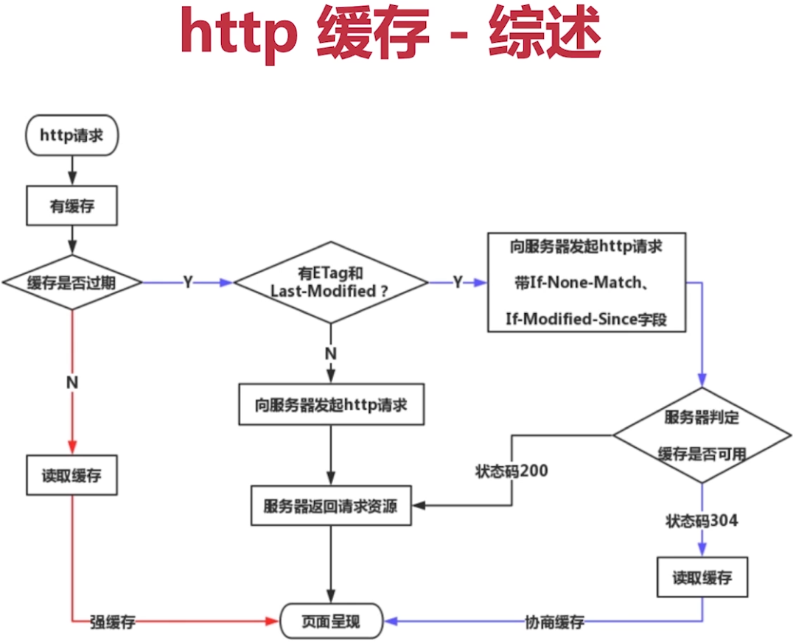

# 描述一下 http 的缓存机制

关于缓存

- 什么是缓存？把无需再请求一次的资源存一份在本地
- 为什么需要缓存？使页面加载更快，因为网络请求慢，不稳定
- 哪些资源可以被缓存？静态资源（js css img）

强制缓存

Cache-Control

- Response Headers 中
- 控制强制缓存的逻辑
- 例如 Cache-Control:max-age=31536000（单位是秒）
- 值：**max-age，no-cache**（不强制缓存），no-store（不强制缓存，也不用服务端缓存措施，不常用），private（最终用户缓存），public（中间的路由也可以缓存）

Expires

- 同在 Response Headers 中
- 同为控制缓存过期
- 已被 Cache-Control 代替

协商缓存（对比缓存）

- 服务端缓存策略
- 服务端判断客户端资源，是否和服务端资源一样
- 一致则返回 304，否则返回 200 和最新的资源  
    

资源标识

- 在 Response Headers 中，有两种
- Last-Modified 资源的最后修改时间  
    
- Etag 资源的唯一标识（**`nginx` 中 `etag` 由响应头的 `Last-Modified` 与 `Content-Length` 表示为十六进制组合而成**）https://juejin.cn/post/6844904018012012552  
    

Last-Modified 和 Etag

- 会优先使用 Etag
- Last-Modified 只能精确到秒级
- 如果资源被重新生成，而内容不变，则 Etag 更准确  
    

三种刷新操作

- 正常操作：地址栏输入 url，跳转链接，前进后退等
- 手动刷新：F5，点击刷新按钮，右击菜单刷新
- 强制刷新：ctrl + F5

不同刷新操作，不同的缓存策略

- 正常操作：强制缓存有效，协商缓存有效
- 手动刷新：强制缓存失效，协商缓存有效
- 强制刷新：强制缓存失效，协商缓存失效
 
 
 
 
 
 
 
 
 
 
 
 
 
 
 
 
 
 
 
 
 
 
 
 
 
