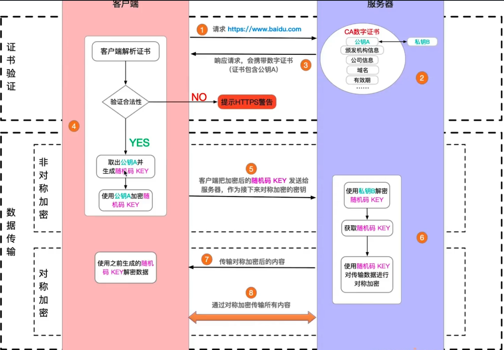

# https 加密方式和过程解析

**http 和 https**

- http 是明文传输，敏感信息容易被中间劫持
- https = http + 加密，劫持了也无法解密
- 现代浏览器强制 https 协议

**加密方式**：对称加密，非对称加密

- 对称加密：一个 key 同时负责加密、解密
- 非对称加密：一对 key，A 加密之后，只能用 B 来解密
- https 同时用了两种加密方式

**https 证书**

- 防止中间人攻击
  - 中间人劫持服务端的数据包，解析数据包获取服务端的 pubkey
  - 使用某种方式把服务端的 pubkey 替换成自己的 pubkey，发送给客户端
  - 客户端生成会话密码 R，使用接收到数据包的中间人 pubkey 加密，发送给服务端
  - 中间人再次劫持客户端数据包，用自己私钥解密拿到会话密码 R 和数据
- 使用第三方证书（慎用免费，不合规的证书）
- 浏览器校验证书

**过程解析过程**

