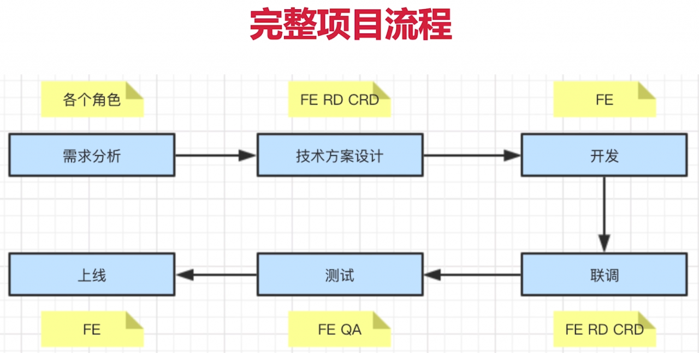

# 前端项目完整流程

1、前端开发相关的项目角色

- PM 产品经理
- UE 视觉设计师
- FE 前端开发
- RD 后端开发
- CRD 移动端开发
- QA 测试人员

2、完整项目流程

3、需求分析

- 了解背景
- 质疑需求是否合理
- 需求是否闭环
- 开发难度如何
- 是否需要其他支持
- 不要急于给排期

4、技术方案设计

- 求简，不过渡设计，如：路由能用 hash 就不用 history
- 产出文档，如：功能需求
- 找准设计重点，如：数据结构等
- 组内评审，一起评审困难点
- 和 RD CRD 沟通
- 发出会议结论，留有文档保底

5、开发，如何保证开发质量

- 合理排期，需要一些缓存时间
- 符合开发规范
- 写出开发文档
- 及时单元测试
- Mock API，模拟数据
- Code Review

6、联调沟通

- 和 RD CRD 技术联调
- 让 UE 确定视觉效果
- 让 PM 确定产品功能

PM 加需求怎么办？

- 不能拒绝，走需求变更流程即可
- 如果公司有规定，则按规定走
- 否则，发起项目组合 leader 的评审，重新评估排期

7、测试

- 提测发邮件，抄送项目组
- 测试问题要详细记录
- 有问题及时沟通，QA 和 FE 天生信息不对称

“我电脑没问题呀！”

- 不要说这句话！
- 当面讨论，让 QA 帮你复现
- 如果需要特定设备才能复现，让 QA 提供设备

8、上线

- 上线后及时通知 QA 回归测试
- 上线后及时同步给 PM 和项目组
- 如有问题，及时回滚。先止损，再排斥问题

9、项目沟通

- 多人协作，沟通时最重要的事情
- 每日一沟通（如站会），有事说事，无事报平安
- 及时识别风险，及时汇报
 
 
 
 
 
 
 
 
 
 
 
 
 
 
 
 
 
 
 
 
 
 
 
 
 
